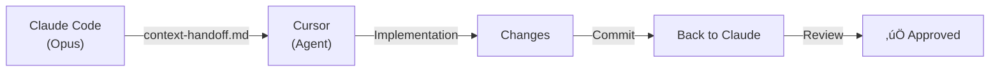
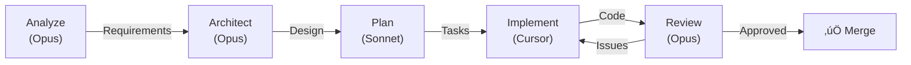

# Claude Code Instructions

> Full-Stack DevTools Engineer

## CRITICAL: Non-Negotiable Rules

**IMPORTANT:** These rules are MANDATORY and must ALWAYS be followed:

1. **NEVER** hardcode secrets - use environment variables
2. **NEVER** skip quality gates (`--no-verify`, `HUSKY=0`)
3. **NEVER** use destructive git commands (`reset --hard`, `clean -fd`) without user approval
4. **NEVER** edit content in dist/ - it's generated
5. **ALWAYS** run `npm run quality` before committing
6. **ALWAYS** search existing solutions first (codebase, deps, docs)
7. **ALWAYS** communicate in Russian (code comments in English)
8. **ALWAYS** follow import rule: commands → utils → types (never reverse)
9. **ALWAYS** use beads for task tracking

## Quick Start

```bash
# Essential commands - memorize these
npm run watch           # Dev server ()
npm run quality # MANDATORY before commit
       # Generate API types
              # Check available work
```

**Keyboard shortcuts:**

- **`#`** - Type `#` to see file/symbol suggestions in prompts
- **`@`** - Reference files or symbols directly
- **`/`** - Access slash commands (analyze, architect, plan, review)

## Project Overview

**shared-ai-configs** - NPM package for generating AI-assisted development configurations for Claude Code and Cursor IDE

**Stack:** | Vitest

## Workflow Commands

### Development

```bash
npm run watch           # Dev server
npm run build         # Production build
npm run lint          # 
npm run test          # Vitest
       # Generate API (Codegen)
```

### Task Management ()

```bash
                           # Find available work
 <id> --status=in_progress # Claim task
 <id>                      # Complete task
               # Export to JSONL
```

### Session End (MANDATORY)

```bash
# 1. Run quality gates
npm run quality

# 2. If gates FAIL - fix issues, re-run (see .claude/TROUBLESHOOTING.md)

# 3. Only after gates pass:
git add <files> && git commit -m "type(scope): description"

```

## Memory & Context

### Session Start (Auto via hooks)

The session-start hook automatically loads context. Manually refresh with:

```bash
                                    # Available tasks
mcp__hindsight-alice__recall "sac project context"
/mcp                                        # Check server health
```

### During Work

- **ALWAYS** use TodoWrite for multi-step tasks
- Use `retain` to save important decisions
- Use Context7 before implementing unfamiliar APIs
- Use `reflect` for complex decisions requiring synthesis

### Session End

```bash
mcp__hindsight-alice__retain "Session summary: [what was done]"

```

## Context Handoff Protocol (Claude Code ↔ Cursor)

**Problem:** 5K tokens wasted per IDE switch without structured protocol



**Setup:**

```yaml
# .claude/context-handoff/current.md
phase: "implementation"
task_id: "xyz"
scope: "Only modify src/pages/auth/ - don't touch generated API"
api_contract: "docs/API-CONTRACT.md"
test_plan: "docs/TEST-PLAN.md"
```

## SDLC Workflow



**Skip rules:**

- New feature: All 5 phases
- Enhancement: Plan → Implement → Review
- Bug fix: Plan → Implement
- Simple fix: Implement only

## MCP Tools

**Full guide:** `docs/guides/mcp-tools-complete.md`

| Server               | Tools                                         | Use For                          |
| -------------------- | --------------------------------------------- | -------------------------------- |
| **hindsight-alice**  | `recall`, `reflect`, `retain`                 | Long-term memory                 |
| **MCP_DOCKER**       | Context7, Jira, Confluence                    | Docs & project mgmt              |
| **zread**            | `search_doc`, `read_file`                     | GitHub repos                     |
| **Figma**            | `get_design_context`                          | Design to code                   |
| **zai-mcp-server**   | `ui_to_artifact`, `diagnose_error_screenshot` | Image analysis                   |
| **claude-in-chrome** | `navigate`, `computer`, `read_page`           | Browser automation               |

### MCP Priority Order

1. **** → Task context (``)
2. **Codebase** → Existing patterns (Glob, Grep)
3. **Hindsight** → Past decisions (`recall`, `reflect`)
4. **Context7** → Library docs (`resolve-library-id` → `get-library-docs`)
5. **WebSearch** → External info (last resort)

### Quick MCP Commands

```bash
# Library docs
mcp__MCP_DOCKER__resolve-library-id "tanstack query"
mcp__MCP_DOCKER__get-library-docs "/tanstack/query" --topic "mutations"

# Memory
mcp__hindsight-alice__recall "How do we handle errors?"
mcp__hindsight-alice__retain "Decision: Use X because Y"

```

### When to Use Context7 vs WebSearch

**Context7** (Library Documentation Lookup):

- ✅ Looking up API documentation for known libraries (React, TanStack Query, Zustand)
- ✅ Checking specific method signatures or parameters
- ✅ Understanding library patterns and best practices
- ✅ Finding examples from official library docs
- ❌ NOT for current events, external data, or non-library info

**WebSearch** (External Information):

- ✅ Current framework updates or latest versions
- ✅ External API documentation not in project
- ✅ Community best practices and discussions
- ✅ Problem solutions from Stack Overflow or blogs
- ❌ NOT for project-internal patterns (use Hindsight instead)

**Pattern:**

```bash
# Unknown library API? → Context7
mcp__MCP_DOCKER__resolve-library-id "name-of-library"
mcp__MCP_DOCKER__get-library-docs "/org/project" --topic "what-you-need"

# Need current info? → WebSearch
mcp__web-search-prime__webSearchPrime search_query="latest react patterns 2026"

# Need project decision? → Hindsight (not WebSearch)
mcp__hindsight-alice__recall "How do we handle [pattern] in this project?"
```

## Documentation

| Topic            | Location                                                       |
| ---------------- | -------------------------------------------------------------- |
| **MCP guide**    | `.claude/MCP-GUIDE.md`                                         |
| Session protocol | `.claude/SESSION-PROTOCOL.md`                                  |
| Troubleshooting  | `.claude/TROUBLESHOOTING.md`                                   |
| AI SDLC workflow | `core/workflow/ai-sdlc-workflow.mdc` (universal roles)         |
| Hooks config     | `.claude/settings.json`                                        |
| Cursor rules     | `.cursor/rules/INDEX.mdc` (41 rules, also work in Claude Code) |

## Sprint/Milestone Close

```bash
# Quick cleanup - delete temp banks, prune old docs

CUTOFF=$(date -v-7d +%Y-%m-%d)
curl -X DELETE "http://localhost:8888/v1/default/banks/reflections"
curl -X DELETE "http://localhost:8888/v1/default/banks/session"
```

## Tips for Efficiency

1. **Use `#` key** to quickly reference files when asking questions
2. **Name sessions** with `/rename <task>` for easy resume
3. **Check `/mcp`** if tools stop responding
4. **Use `reflect`** for complex decisions requiring synthesis
5. **Compact context** with `/compact` when responses slow down
6. **Resume sessions** with `claude --continue` or `claude --resume <name>`

## AI SDLC Workflow (Role-Based)

> **Full documentation**: `core/workflow/ai-sdlc-workflow.mdc`

**Principle:** Assign tasks by **capability needed**, not specific product.

### SDLC Roles

| Role | Capability | Example Agents |
|------|-----------|----------------|
| **ANALYST** | Deep reasoning, research | Opus, GPT-4o, Gemini Pro |
| **ARCHITECT** | System design | Opus, Claude with tools |
| **PLANNER** | Task breakdown | Sonnet, GPT-4 |
| **IMPLEMENTER** | Fast coding | Cursor Agent, Copilot, Sonnet |
| **REVIEWER** | Quality check | Opus, Snyk, SonarQube |

### Workflow

```
ANALYST → ARCHITECT → PLANNER → IMPLEMENTER → REVIEWER
```

### Why Role-Based?

- **Flexible**: Any agent can fill any role if it has the capability
- **Future-proof**: New tools automatically fit into existing workflow
- **Clear handoffs**: Roles define what context to pass, not which tool to use

### IDE Synchronization Rules

1. **Rules Parity:** All 41 rules from `.cursor/rules/INDEX.mdc` apply to both IDEs
2. **Git Workflow:** Both IDEs use stealth mode (no auto-push, no auto-commit)
3. **Integration:** Both IDEs auto-detect `.beads/` directory for issue tracking
4. **Quality Gates:** Both IDEs enforce `npm run quality` before commit
5. **Changes Sync:** Updates to `.cursor/rules/` must be reflected in `.claude/` documentation

### Language Preference

**All strategic documentation (plans, roadmaps, architectural decisions) must be in Russian** for improved team readability and comprehension. Code comments remain in English per ESLint rules.

### Model Selection Strategy: Opus vs Sonnet

**When to use each model:**

#### 🧠 **Opus**

- ✅ Architectural decisions
- ✅ Deep code review
- ✅ Critical bug analysis
- ✅ Security decisions
- ✅ Complex reasoning

#### 📊 **Sonnet/Haiku (for standard work)**

- ✅ Implementation
- ✅ Test writing
- ✅ Code generation
- ✅ Routine refactoring

**Rule:** Use Opus for critical decisions, Sonnet for implementation.

---

_Code style enforced by  - no need to memorize rules._
