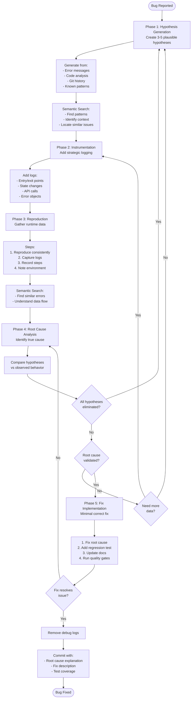

# Debug Mode

## Workflow



## Semantic Search Integration

Use semantic search throughout debugging:

| Phase                      | Query Examples                                    |
| -------------------------- | ------------------------------------------------- |
| Hypothesis Generation      | "Where do we handle error responses?"             |
| Understanding Architecture | "How does authentication flow work?"              |
| Finding Patterns           | "Show me how other components handle async state" |
| Root Cause Analysis        | "Find similar error handling in codebase"         |

**Benefits**: +12.5% accuracy in finding relevant code, +23.5% for context discovery

## Debugging Checklist

- [ ] Created 3-5 hypotheses
- [ ] Added instrumentation for each hypothesis
- [ ] Reproduced bug consistently
- [ ] Collected runtime data
- [ ] Identified root cause
- [ ] Implemented minimal fix
- [ ] Added regression test
- [ ] Verified fix resolves issue
- [ ] Ran quality gates
- [ ] Removed debug logs

## Examples

```bash
@debug.md Users see blank page after clicking "Save"
@debug.md TypeError: Cannot read properties of undefined
@debug.md List takes 10 seconds to load with 100 items
```

## Commit Template

```bash
git commit -m "fix: [bug description]

Root cause: [explanation]
- Fix: [what was changed]
- Test: [added regression test]
Refs: {PREFIX}-XXX"
```

## References

- `@search-patterns.md` — Semantic search best practices
- `@quality` — Core development rules
- `@testing.mdc` — Testing for regression
