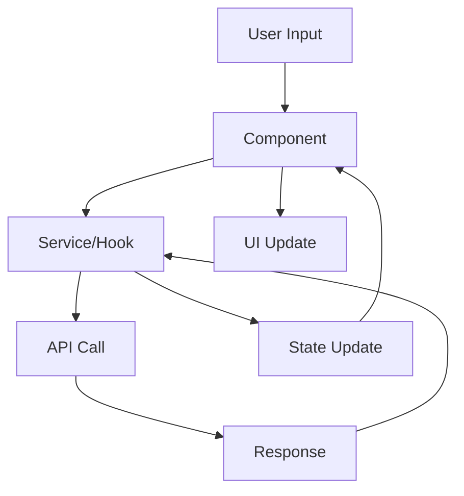
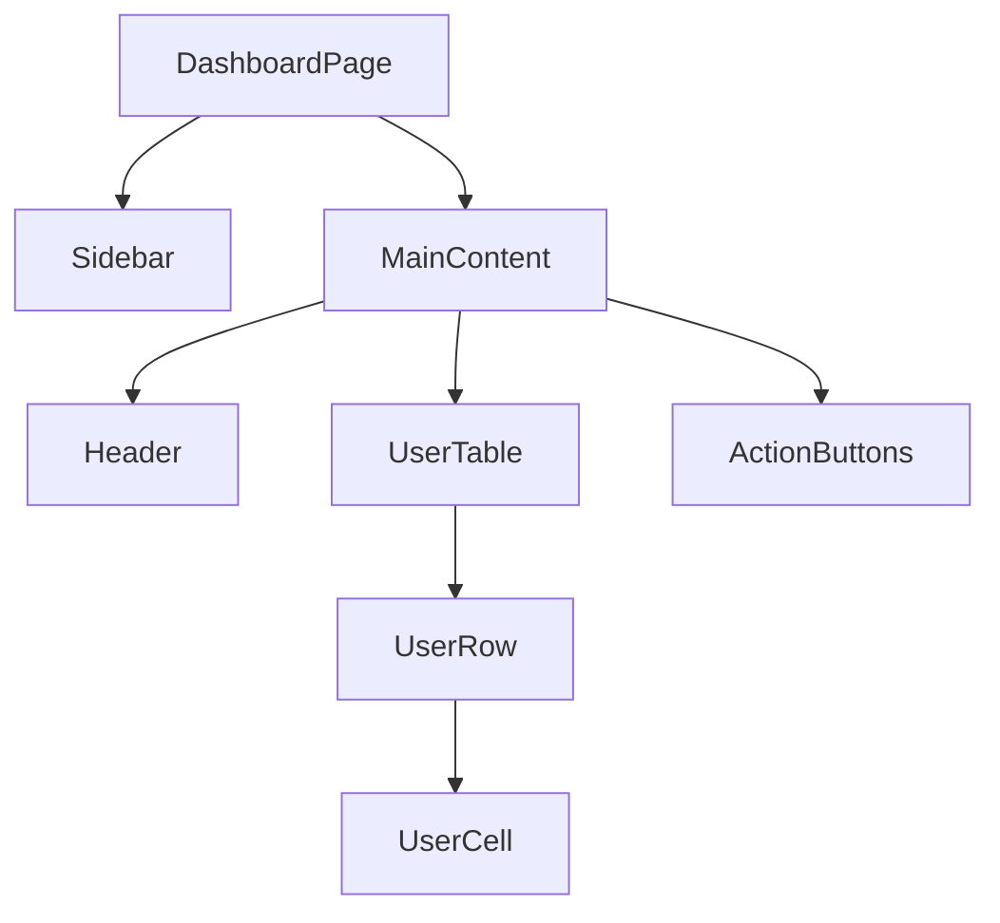
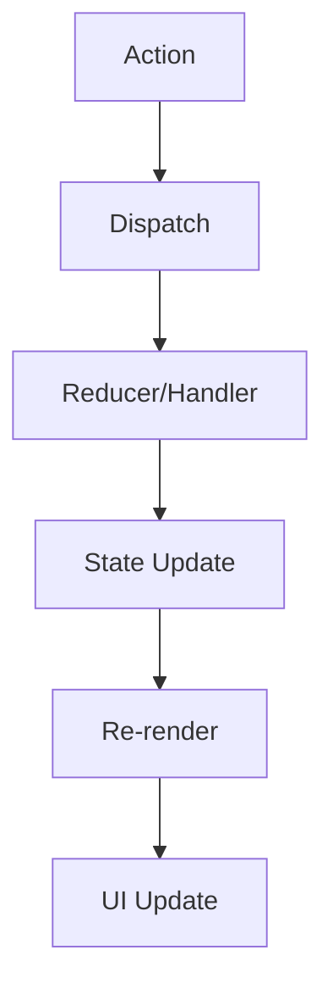
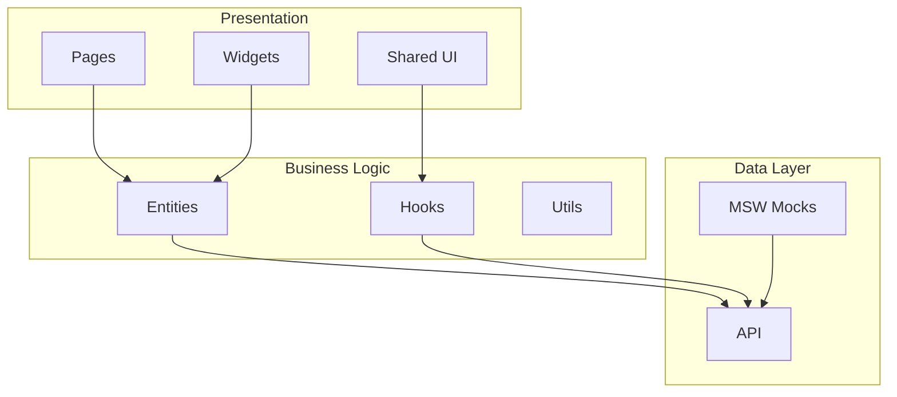

# Architecture Diagrams

**Diagram command for generating Mermaid architecture diagrams: data flow, component hierarchy, state management**

## Usage

```bash
@diagram.md [type] [scope]
```

## Diagram Types

### 1. Data Flow Diagram

Shows how data flows through components and systems.

**Example:**

```bash
@diagram.md dataflow User authentication
```

**Template:**



### 2. Component Hierarchy

Shows parent-child relationships and composition.

**Example:**

```bash
@diagram.md hierarchy Dashboard page
```

**Template:**



### 3. State Management Flow

Shows how state is managed and updated across the app.

**Example:**

```bash
@diagram.md state User profile management
```

**Template:**



### 4. Architecture Overview

High-level system architecture with layers.

**Example:**

```bash
@diagram.md architecture Customer Portal
```

**Template:**



## Output Locations

Diagrams are saved to:

1. **Task Documentation:** Add to task description in Beads/Jira
2. **Architecture Docs:** `docs/architecture/` for system-wide diagrams
3. **Feature Guides:** `docs/guides/` for feature-specific diagrams

## Best Practices

**Naming:**

- Use clear, descriptive node names
- Group related nodes into subgraphs
- NO custom `style` or `fill:` colors (breaks dark theme)

**Clarity:**

- Keep diagrams focused (one concern per diagram)
- Limit to 10-15 nodes for readability
- Use subgraphs for visual grouping instead of colors

**Maintenance:**

- Update diagrams when architecture changes
- Version in git
- Reference in documentation

**See:** `@123-mermaid-diagrams` for full standards

## Examples

```bash
# Data flow for login
@diagram.md dataflow User login flow

# Component hierarchy for orders page
@diagram.md hierarchy Orders page components

# State management for shopping cart
@diagram.md state Cart state management

# Architecture overview
@diagram.md architecture Frontend architecture

# API integration flow
@diagram.md dataflow API request/response handling
```

## Integration with Workflow

- **Plan Mode:** Use diagrams to visualize planned architecture
- **Debug Mode:** Use diagrams to understand complex flows
- **Documentation:** Include diagrams in feature docs
- **Code Reviews:** Verify code matches diagram

## References

- `@architecture.mdc` — FSD architecture guidelines
- `@004-quality.mdc` — Core development rules
- Mermaid documentation: https://mermaid.js.org/intro/
