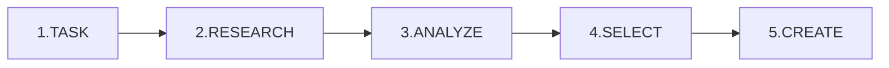

# Documentation Command

**Universal documentation creation with full research cycle and best practices.**

## Usage

```bash
/docs [topic or request]
/docs --type=[type] [topic]
/docs --quick [topic]
```

## Document Types

| Type | Flag | Use Case |
|------|------|----------|
| **Agent Rules** | `--type=agent-rules` | .mdc files for Claude/Cursor |
| **API Docs** | `--type=api` | Endpoint documentation |
| **Feature Docs** | `--type=feature` | User-facing features |
| **Guide** | `--type=guide` | How-to, tutorials |
| **Reference** | `--type=reference` | Cheatsheets, quick ref |
| **Architecture** | `--type=adr` | ADRs, design docs |
| **Quick** | `--quick` | Minimal research, fast output |

## Core Workflow



### Phase 1: TASK - Define Scope

**Questions to answer:**

- What needs documenting?
- Who is the audience? (AI agent, developer, user)
- Where will it live?
- How detailed?

```bash
# Load similar past docs
hindsight.recall("similar documentation patterns")
```

### Phase 2: RESEARCH - Gather Sources

**Source priority:**

1. **Official docs** → `context7.get-library-docs()` or `WebFetch`
2. **Source code** → `Grep`, `Read` (actual implementation)
3. **Project history** → `hindsight.recall()` (past decisions)
4. **Community** → `WebSearch` (best practices 2026)
5. **Agent docs** → Anthropic/Cursor documentation

**Research checklist:**

- [ ] Official docs consulted
- [ ] Source code reviewed
- [ ] Project conventions checked
- [ ] Community practices researched
- [ ] Info verified as current

### Phase 3: ANALYZE - Extract Patterns

**For each source, extract:**

- KEY CONCEPTS - must document
- PATTERNS - reusable approaches
- ANTI-PATTERNS - what to avoid
- EXAMPLES - good code samples
- EDGE CASES - special scenarios

```bash
# Deep analysis with context preservation
pal.thinkdeep(
  step: "Analyzing documentation patterns",
  findings: "[research summary]"
)
→ Save continuation_id
```

### Phase 4: SELECT - Choose Best Approach

**Criteria:**
| Factor | Weight |
|--------|--------|
| Accuracy | CRITICAL |
| Completeness | HIGH |
| Clarity | HIGH |
| Actionability | HIGH |
| Maintainability | MEDIUM |

```bash
# Store decision
hindsight.retain("Docs decision: [approach] because [reasons]")
```

### Phase 5: CREATE - Write Documentation

**Writing principles:**

- Start with most important info
- Use concrete examples
- Include error handling
- Write for scanning (headers, bullets, tables)
- Test all code examples
- Cite sources

## Quick Templates

### Agent Rules (.mdc)

```markdown
---
description: '[Purpose]'
alwaysApply: false
---

# [Rule Name]

## When to Apply
- [Trigger 1]

## Rules

### [Category]
| Do | Don't |
|----|-------|
| [Good] | [Bad] |

## Examples
[code examples]
```

### Feature Documentation

```markdown
# [Feature]

## Overview
[1-2 sentences]

## Quick Start
[minimal example]

## Features
- **[Feature]**: [Description]

## Configuration
| Option | Type | Default | Description |

## Troubleshooting
| Problem | Solution |
```

### API Documentation

```markdown
# [Endpoint]

## Overview
[Purpose]

## Endpoint
[METHOD] /path

## Parameters
| Name | Type | Required | Description |

## Response
[example]

## Errors
| Code | Meaning | Solution |
```

## MCP Tools by Phase

| Phase | Tools |
|-------|-------|
| TASK | `hindsight.recall` |
| RESEARCH | `context7`, `WebSearch`, `WebFetch`, `Grep`, `Read` |
| ANALYZE | `pal.thinkdeep`, `pal.consensus` |
| SELECT | `hindsight.retain` |
| CREATE | `Edit`, `Write` |

## Examples

```bash
# Create agent rules for error handling
/docs "Agent rules for error handling patterns"

# API documentation
/docs --type=api "Document authentication endpoints"

# Quick cheatsheet
/docs --quick "TypeScript utility types reference"

# Feature documentation
/docs --type=feature "New dark mode feature"

# How-to guide
/docs --type=guide "Setting up local development environment"
```

## Quality Checklist

Before completing documentation:

- [ ] All facts verified with sources
- [ ] Code examples tested
- [ ] Error scenarios documented
- [ ] Links verified
- [ ] Matches project style
- [ ] Version info current
- [ ] Related docs linked

## Agent Instructions

### For Claude Code

1. Use `Read`/`Grep` for codebase patterns
2. Use `WebSearch` with year 2026 for current practices
3. Use `context7` for library docs
4. Follow CLAUDE.md project conventions
5. Russian for strategic docs, English for code

### For Cursor

1. Check `.cursor/rules/` for conventions
2. Use `.mdc` format for rules
3. Apply `alwaysApply: false` unless universal
4. Test in Composer before commit

### Universal

1. NEVER hallucinate - verify all facts
2. ALWAYS provide examples
3. INCLUDE error handling
4. CITE sources when possible
5. VERSION time-sensitive info
6. TEST all code examples

## References

- `@documentation-workflow` — Full skill documentation
- `@skills-patterns` — MCP workflow patterns
- `@code-review` — For reviewing docs
