# Implement Task

## Workflow

```mermaid
flowchart TD
    Start([User Task Request]) --> Step1[Step 1: Check Ready Work<br/>bd ready --json]

    Step1 --> HasWork{Has ready<br/>Beads work?}
    HasWork -->|Yes| LoadExisting[Step 2: Load Context<br/>bd show ID --json]
    HasWork -->|No| CreateNew[Determine if new<br/>Jira task needed]

    CreateNew --> TaskType{Task type?}
    TaskType -->|Team sync<br/>needed| Step4[Step 4: Create Jira Task<br/>via MCP]
    TaskType -->|Local only| Step5

    Step4 --> Step5[Step 5: Create Beads Epic<br/>IMMEDIATELY<br/>link to Jira]

    LoadExisting --> Step2[Step 2: Load Context<br/>from MCPs]
    Step5 --> Step2

    Step2 --> MCP_Beads[Beads MCP:<br/>Get task description<br/>research, progress]
    MCP_Beads --> MCP_Hindsight[Hindsight MCP:<br/>Recall patterns<br/>for task type]
    MCP_Hindsight --> MCP_Jira{Team task?}

    MCP_Jira -->|Yes| LoadJira[Jira MCP:<br/>Get issue details]
    MCP_Jira -->|No| MCP_Context7
    LoadJira --> MCP_Context7[Context7 MCP:<br/>Library docs<br/>if needed]

    MCP_Context7 --> Step3[Step 3: Analyze Task<br/>Understand requirements]

    Step3 --> AnalyzeComplexity[Determine complexity:<br/>- Scope<br/>- Dependencies<br/>- Risks]
    AnalyzeComplexity --> StoreAnalysis[Store analysis in<br/>Beads task description<br/>bd update ID]

    StoreAnalysis --> Step6[Step 6: Decompose Task<br/>into subtasks]

    Step6 --> CreateSubtasks[Create Beads Tasks<br/>deps: Epic<br/>1. Setup<br/>2. Implementation<br/>3. Tests]

    CreateSubtasks --> Step7[Step 7: Implement<br/>Following patterns]

    Step7 --> FollowPatterns[Use patterns from:<br/>- Hindsight MCP<br/>- .cursor/rules/<br/>- Existing codebase]

    FollowPatterns --> ImplementLoop[For each subtask:<br/>1. Claim task<br/>2. Implement<br/>3. Store progress]

    ImplementLoop --> Step8[Step 8: Store Results]

    Step8 --> StoreBeads[Beads:<br/>bd update ID<br/>--description<br/>Store findings]
    StoreBeads --> StoreHindsight[Hindsight MCP:<br/>remember<br/>Store patterns]

    StoreHindsight --> Step9[Step 9: Report Progress]

    Step9 --> ReportFormat[Report:<br/>- What was done<br/>- What was learned<br/>- Next steps]

    ReportFormat --> MoreSubtasks{More<br/>subtasks?}
    MoreSubtasks -->|Yes| ImplementLoop
    MoreSubtasks -->|No| Complete[Task Complete]

    Complete --> End([Implementation Done])
```

## Triggers

- Jira task reference (VP-XXX)
- New task description
- Feature request
- Bug fix request

## MCP Integration

**All intermediate reports and research results MUST be stored:**

1. **Beads task description** (`bd update <id> --description`):

   - Store research results during investigation
   - Store analysis reports
   - Store implementation context
   - Store investigation findings (all in task description)

2. **Hindsight MCP** (`user-hindsight-alice`):
   - Store reflection and lessons learned
   - Store coding patterns and architectural decisions
   - Store experience and opinions
   - Recall patterns from previous work

**This is MCP workflow - all reports go through MCP, not temporary files.**

## References

- `@beads` — Core Beads workflow
- `@start.md` — Session start workflow
- `@session/create-tasks.md` — Create tasks scenarios
- `@existing-solutions-first.mdc` — Search before implement
- `@communication-style.mdc` — Reporting style
- `@hindsight` — Hindsight MCP usage
