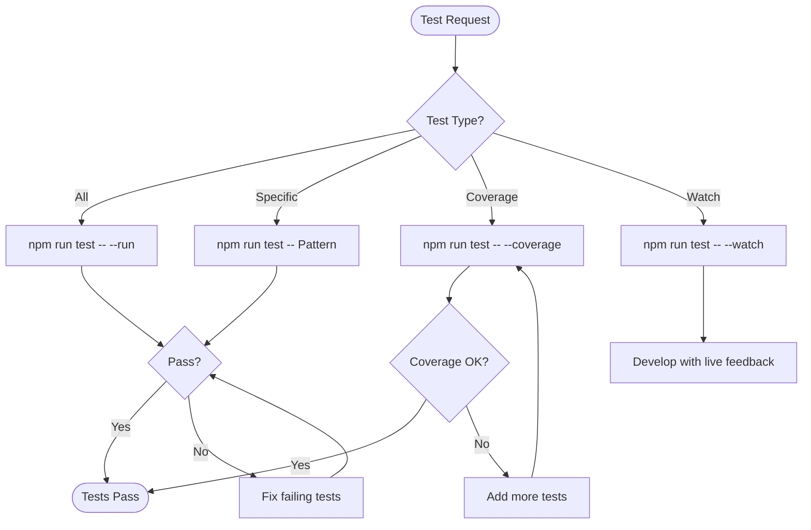

# Test Workflow

## Quick Commands

| Command                       | Purpose                    |
| ----------------------------- | -------------------------- |
| `npm run test`                | Run all tests (watch mode) |
| `npm run test -- --run`       | Run once and exit          |
| `npm run test -- --coverage`  | With coverage report       |
| `npm run test -- MyComponent` | Specific file pattern      |
| `npm run test -- --watch`     | Watch mode (default)       |

## Workflow



## Running Tests

### All Tests

```bash
# Run once (CI mode)
npm run test -- --run

# Watch mode (development)
npm run test
```

### Specific Tests

```bash
# By file name
npm run test -- CargoTable

# By path
npm run test -- src/pages/

# By test name
npm run test -- -t "should render loading state"
```

### With Coverage

```bash
# Full coverage report
npm run test -- --coverage

# Coverage for specific files
npm run test -- --coverage src/pages/
```

## Coverage Requirements

| Category       | Target | Description                          |
| -------------- | ------ | ------------------------------------ |
| Critical paths | 90%    | Auth, payments, core business logic  |
| Components     | 80%    | UI components with user interactions |
| Utilities      | 100%   | Pure functions, helpers              |
| Hooks          | 85%    | Custom hooks with logic              |
| Overall        | 80%    | Project minimum                      |

## Test Structure

### Component Test

```typescript
import { render, screen, fireEvent } from '@testing-library/react'
import { describe, it, expect, vi } from 'vitest'
import { CargoTable } from './CargoTable'

describe('CargoTable', () => {
  // Setup
  const mockData = [/* ... */]
  const mockOnSelect = vi.fn()

  // Rendering
  it('renders table with data', () => {
    render(<CargoTable data={mockData} />)
    expect(screen.getByRole('table')).toBeInTheDocument()
  })

  // Loading state
  it('shows loading skeleton when loading', () => {
    render(<CargoTable data={[]} isLoading />)
    expect(screen.getByTestId('table-skeleton')).toBeInTheDocument()
  })

  // Empty state
  it('shows empty message when no data', () => {
    render(<CargoTable data={[]} />)
    expect(screen.getByText(/no cargo requests/i)).toBeInTheDocument()
  })

  // User interaction
  it('calls onSelect when row clicked', () => {
    render(<CargoTable data={mockData} onSelect={mockOnSelect} />)
    fireEvent.click(screen.getByText(mockData[0].name))
    expect(mockOnSelect).toHaveBeenCalledWith(mockData[0])
  })

  // Error state
  it('shows error message on error', () => {
    render(<CargoTable data={[]} error={new Error('Failed')} />)
    expect(screen.getByRole('alert')).toHaveTextContent(/failed/i)
  })
})
```

### Hook Test with MSW

```typescript
import { renderHook, waitFor } from '@testing-library/react';
import { describe, it, expect, beforeAll, afterAll, afterEach } from 'vitest';
import { worker } from 'src/mocks/browser';
import { http, HttpResponse } from 'msw';
import { useCargoList } from './useCargoList';
import { createWrapper } from 'test/utils';

describe('useCargoList', () => {
  beforeAll(() => worker.listen());
  afterEach(() => worker.resetHandlers());
  afterAll(() => worker.close());

  it('fetches cargo list successfully', async () => {
    const { result } = renderHook(() => useCargoList(), {
      wrapper: createWrapper(),
    });

    await waitFor(() => {
      expect(result.current.isSuccess).toBe(true);
    });

    expect(result.current.data).toHaveLength(10);
  });

  it('handles error response', async () => {
    worker.use(
      http.get('/api/cargo', () => {
        return HttpResponse.json({ error: 'Server error' }, { status: 500 });
      })
    );

    const { result } = renderHook(() => useCargoList(), {
      wrapper: createWrapper(),
    });

    await waitFor(() => {
      expect(result.current.isError).toBe(true);
    });
  });
});
```

## MSW Handler Validation

```bash
# Check handlers match OpenAPI spec
npm run mocks:check

# List all handlers
npm run mocks:list
```

## Debugging Tests

### Verbose Output

```bash
# Show console.log output
npm run test -- --reporter=verbose

# Debug specific test
npm run test -- --reporter=verbose -t "test name"
```

### VS Code Debugging

1. Add breakpoint in test file
2. Run "Debug Tests" from command palette
3. Step through code

## Common Issues

### Test Timeouts

```typescript
// Increase timeout for slow tests
it('handles large dataset', async () => {
  // ...
}, 10000); // 10 second timeout
```

### Async State Updates

```typescript
// Always use waitFor for async updates
await waitFor(() => {
  expect(result.current.data).toBeDefined();
});
```

### Mock Reset Issues

```typescript
// Reset mocks between tests
afterEach(() => {
  vi.clearAllMocks();
  worker.resetHandlers();
});
```

## Constraints

| NEVER                       | ALWAYS             |
| --------------------------- | ------------------ |
| Comment out failing tests   | Fix or update them |
| Skip tests in CI            | Run full suite     |
| Test implementation details | Test behavior      |
| Use `any` in test types     | Proper typing      |
| Hardcode test data          | Use factories      |
