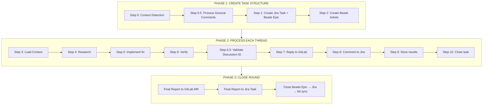

# GitLab Process Comments

```bash
/gitlab-process-comments --mr xx
```

## Workflow



## Critical Rules

| NEVER                      | ALWAYS                                       |
| -------------------------- | -------------------------------------------- |
| Process resolved threads   | Skip `resolved: true`                        |
| Implement without research | Load context first (Step 3-4)                |
| Skip GitLab reply          | Reply BEFORE closing                         |
| Forget final reports       | Report to GitLab + Jira before closing round |
| Skip Hindsight             | Store patterns after each task               |
| Post intermediate comments | ONE final comment after ALL tasks done       |
| Use stale Discussion IDs   | Validate ID before GitLab reply              |

## GitLab Comment Policy (Anti-Spam)

| Comment Type              | When to Post                                    |
| ------------------------- | ----------------------------------------------- |
| **Inline thread reply**   | Only when task COMPLETED (code fixed, verified) |
| **General MR comment**    | Only FINAL report after ALL work done           |
| **Intermediate progress** | ❌ NEVER - no "working on...", "step 1 done..." |

**Why:** Prevents spam, keeps GitLab clean, final report is more useful.

## Communication Protocol

After EACH step:

```
✅ Step N: [Name] - Completed
**What was done:** [...]
**Results:** [...]
**Next step:** [...]
❓ Продолжить?
```

---

## PHASE 1: Create Task Structure

### Step 0: Context Detection

```bash
# 1. GitLab - get unresolved threads (MUST use --open-only flag!)
# IMPORTANT: Use Notes API (not Discussions) for real-time data
npm run gitlab:mr:get-unresolved -- --mr xx --open-only

# 2. GitLab - get general comments
npm run gitlab:mr:get-all-notes -- --mr xx

# 3. Beads - find existing Epic
bd list --json | jq '.[] | select(.description | contains("Review MR-xx"))'
```

```typescript
// 4. Jira - find existing tasks for MR
CallMcpTool({
  server: 'user-MCP_DOCKER',
  toolName: 'jira_search',
  arguments: { jql: 'project = <JIRA_PROJECT> AND labels = mr-xx AND status != Done' },
})

// 5. Hindsight - patterns
CallMcpTool({
  server: 'user-hindsight-alice',
  toolName: 'recall',
  arguments: { bank_id: 'patterns', query: 'MR processing patterns', max_tokens: 4096 },
})
```

**Decision:** No tasks → Round 1 | All Done → Round N+1 | Has Open → Continue

**⏸️ STOP: "Продолжить?"**

### Step 0.5: Process General MR Comments

**Check for general comments (type: null, resolvable: false):**

```bash
npm run gitlab:mr:get-all-notes -- --mr xx
# Filter: type: null, resolvable: false
```

| Comment Type               | Action                           |
| -------------------------- | -------------------------------- |
| Single actionable item     | Create Jira Subtask + Beads Task |
| Multiple related items     | Create Jira Epic + Beads Epic    |
| General feedback/questions | Reply in GitLab (no task)        |
| Investigation needed       | Create investigation task        |

**⏸️ STOP: "Найдены general comments. Продолжить с созданием задач?"**

### Step 1: Create Jira Task + Beads Epic

```typescript
// Create Jira Task (if not exists)
CallMcpTool({
  server: 'user-MCP_DOCKER',
  toolName: 'jira_create_issue',
  arguments: {
    project_key: '<JIRA_PROJECT>',
    summary: '[MR-xx] Code Review Round N',
    issue_type: 'Task',
    labels: ['mr-xx', 'code-review', 'round-N'],
  },
})
```

```bash
# Create Beads Epic IMMEDIATELY
PARENT_EPIC=$(bd create "Epic: {PREFIX}-XXX - MR-xx Round N" --type=epic -p 1 --json | jq -r '.id')
bd update $PARENT_EPIC --description="Jira: {PREFIX}-XXX
Type: MR Review
Round: N"
```

**⏸️ STOP: "Продолжить с созданием задач для threads?"**

### Step 2: Create Beads Tickets for ALL Threads

For each thread:

1. **Parse** original comment
2. **Create** structured ТЗ
3. **Store** in Beads (description = ТЗ, comment = original)

```bash
# 1. Create task
TASK=$(bd create "{PREFIX}-XXX: [title]" --deps epic:$PARENT_EPIC -p 1 --json | jq -r '.id')

# 2. Description = structured ТЗ
bd update $TASK --description="## Задача
[Краткое описание что нужно сделать]

## Требования
- [ ] Requirement 1
- [ ] Requirement 2

## Контекст
- GitLab Discussion ID: [id]
- Note ID: [note_id] (more stable)
- File: [path]:[line]
- Jira: {PREFIX}-XXX

## Before Reply
⚠️ VALIDATE Discussion ID before GitLab reply!
npm run gitlab:mr:get-unresolved -- --mr xx | grep [id]

## Acceptance Criteria
- TypeScript компилируется
- ESLint passed
- Discussion ID validated"

# 3. Comment = original text (для истории)
bd comment add $TASK "**Original GitLab comment:**
> [Original reviewer comment text]

Author: @reviewer
Date: [date]"
```

**Complex thread (2+ actions):**

```bash
EPIC=$(bd create "Epic: [title]" --deps epic:$PARENT_EPIC --type=epic -p 1 --json | jq -r '.id')
TASK1=$(bd create "Step 1" --deps epic:$EPIC -p 1 --json | jq -r '.id')
# Same ТЗ structure for each subtask
```

**⏸️ STOP: "Структура создана. Продолжить с первым thread?"**

---

## PHASE 2: Process Each Thread

### Step 3: Load Context (Four Pillars)

```bash
# 1. Beads - текущая задача
bd show <task-id> --json
```

```typescript
// 2. Hindsight - паттерны
CallMcpTool({
  server: 'user-hindsight-alice',
  toolName: 'recall',
  arguments: { bank_id: 'patterns', query: 'patterns for [area]', max_tokens: 4096 },
})

// 3. Jira - контекст (если нужно)
CallMcpTool({
  server: 'user-MCP_DOCKER',
  toolName: 'jira_get_issue',
  arguments: { issue_key: '{PREFIX}-XXX' },
})

// 4. Context7 - документация (если нужно)
CallMcpTool({
  server: 'MCP_DOCKER',
  toolName: 'resolve-library-id',
  arguments: { libraryName: 'antd' },
})
```

### Step 4: Research Before Implementation

```typescript
// 1. Hindsight - как решали похожие проблемы?
CallMcpTool({
  server: 'user-hindsight-alice',
  toolName: 'recall',
  arguments: { bank_id: 'patterns', query: 'How did we solve [issue type]?', max_tokens: 4096 },
})

// 2. Context7 - best practices (если применимо)
CallMcpTool({
  server: 'MCP_DOCKER',
  toolName: 'get-library-docs',
  arguments: { context7CompatibleLibraryID: '/antd/antd', topic: '[topic]' },
})

// 3. Codebase - существующие паттерны
// grep/glob: найти похожие реализации
```

**⏸️ STOP: "Исследование завершено. Продолжить с реализацией?"**

### Step 5: Implement

```bash
# Read file, get diff, implement fix
read_file(FILE_PATH)
git diff develop...HEAD -- FILE_PATH
search_replace(...)
```

### Step 6: Verify

```bash
npm run lint -- --fix
npm run build
npm run test -- --run
```

**⏸️ STOP: "Верификация пройдена. Продолжить с ответом в GitLab?"**

### Step 6.5: Validate Discussion ID (CRITICAL)

**ALWAYS validate before GitLab reply - prevents 404 errors!**

```bash
# Fetch current unresolved discussions
npm run gitlab:mr:get-unresolved -- --mr xx

# Compare Discussion ID from Beads task with current list
# If NOT found → discussion was resolved or ID changed
```

**MR-321 Lessons (22 consecutive 404 errors):**

- Discussion IDs can change or become invalid
- Note IDs are more stable than Discussion IDs
- If >3 failures → STOP and investigate

**Common Issues:**
| Problem | Solution |
|---------|----------|
| Truncated ID | Check full ID (last char often missing) |
| Changed ID | Re-fetch unresolved list |
| Already resolved | Skip, update Beads task status |

**⏸️ STOP: "ID валиден? Продолжить с ответом?"**

### Step 7: Reply to GitLab Thread

```bash
npm run gitlab:mr:reply -- --mr xx --discussion-id [ID] --body "✅ Fixed: [description]

Files: file1.ts, file2.ts
Verified: ✅ lint ✅ build ✅ tests"
```

**⏸️ STOP: "Ответ отправлен. Продолжить с комментарием в Jira?"**

### Step 8: Comment to Jira (Detailed Report)

```typescript
CallMcpTool({
  server: 'user-MCP_DOCKER',
  toolName: 'jira_add_comment',
  arguments: {
    issue_key: '{PREFIX}-XXX',
    body: `## Что сделано
[Детальное описание]

### Анализ проблемы
[Почему возникла]

### Реализованное решение
[Подход, почему выбран]

### Изменённые файлы
- \`file1.ts\`: [что и почему]

### Ретроспектива
[Lessons learned]`,
  },
})
```

**⏸️ STOP: "Комментарий добавлен. Продолжить с сохранением?"**

### Step 9: Store Results

```bash
# Update Beads
bd update <id> --description="...
Progress: Fixed [what]
Approach: [how]"
```

```typescript
// Store in Hindsight
CallMcpTool({
  server: 'user-hindsight-alice',
  toolName: 'retain',
  arguments: {
    bank_id: 'patterns',
    content: 'MR-xx: Fixed [issue] by [approach]. Pattern: [insight]',
    context: 'mr-review-[area]',
  },
})
```

### Step 10: Close Task

```bash
bd close <task-id> --reason="Fixed: [description]"
```

**⏸️ STOP: "Ещё threads? → Step 3 | Все готовы? → Phase 3"**

---

## PHASE 3: Close Round

### Step 1: Final Report to GitLab MR

```bash
npm run gitlab:mr:add-comment -- --mr xx --body "✅ **Code Review Round N - Complete**

## Обработанные комментарии

| Thread | Status | Jira |
|--------|--------|------|
| [Thread 1] | ✅ Fixed | {PREFIX}-XXX |
| [Thread 2] | ✅ Fixed | {PREFIX}-XXX |

## Проверка
- ✅ ESLint passed
- ✅ TypeScript compiled
- ✅ Tests passed
- ✅ Build successful

**Готово к следующему review.**"
```

**⏸️ STOP: "Отчёт в GitLab отправлен. Продолжить с отчётом в Jira?"**

### Step 2: Final Report to Jira Task

```typescript
CallMcpTool({
  server: 'user-MCP_DOCKER',
  toolName: 'jira_add_comment',
  arguments: {
    issue_key: '{PREFIX}-XXX',
    body: `## Итог Round N

### Выполненные задачи
- {PREFIX}-XXX: [описание] ✅
- {PREFIX}-XXX: [описание] ✅

### Ключевые изменения
[Общее описание]

### Lessons Learned
- [Паттерн 1]
- [Паттерн 2]`,
  },
})
```

**⏸️ STOP: "Отчёт в Jira добавлен. Продолжить с закрытием?"**

### Step 3: Close Round

```bash
# 1. Close Beads Epic
bd close $PARENT_EPIC --reason="Round N complete"

# 2. Sync
bd sync
git push
```

```typescript
// 3. Close Jira Task
CallMcpTool({
  server: 'user-MCP_DOCKER',
  toolName: 'jira_transition_issue',
  arguments: { issue_key: '{PREFIX}-XXX', transition_id: '71' },
})
```

**✅ Round N completed.**

---

## GitLab Scripts

```bash
# CRITICAL: Always use --open-only flag for unresolved threads!
npm run gitlab:mr:get-unresolved -- --mr xx --open-only  # Unresolved threads (Notes API)
npm run gitlab:mr:get-all-notes -- --mr xx               # All notes
npm run gitlab:mr:reply -- --mr xx --discussion-id [ID] --body "..."
npm run gitlab:mr:add-comment -- --mr xx --body "..."
```

**Why Notes API?**

- Discussions API caches data and may show stale status
- Notes API provides real-time unresolved/resolved status
- Fixed in 2026-01-19: get-unresolved.ts now uses `/notes` endpoint

## References

- @beads - Core Beads workflow
- @mcp.md - MCP tools reference
