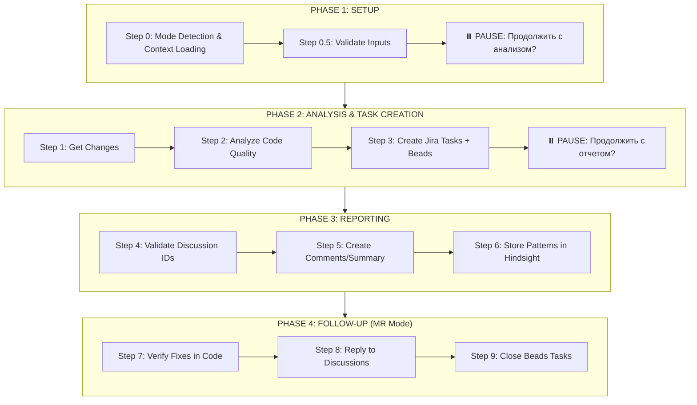

# Code Review (MR or Local) with Reflection

**AI-first workflow for generating professional code review with Beads and Hindsight Alice integration.**

```bash
/gitlab-review-mr --mr <ID>     # MR mode
/gitlab-review-mr --base <REF>  # Local mode
```

## Workflow


```mermaid
flowchart TB
    subgraph P1["PHASE 1: SETUP"]
        S0["Step 0: Mode Detection & Context Loading"]
        S05["Step 0.5: Validate Inputs"]
        PAUSE1["⏸️ PAUSE: Продолжить с анализом?"]
        S0 --> S05 --> PAUSE1
    end

    subgraph P2["PHASE 2: ANALYSIS & TASK CREATION"]
        S1["Step 1: Get Changes"]
        S2["Step 2: Analyze Code Quality"]
        S3["Step 3: Create Jira Tasks + Beads"]
        PAUSE2["⏸️ PAUSE: Продолжить с отчетом?"]
        S1 --> S2 --> S3 --> PAUSE2
    end

    subgraph P3["PHASE 3: REPORTING"]
        S4["Step 4: Validate Discussion IDs"]
        S5["Step 5: Create Comments/Summary"]
        S6["Step 6: Store Patterns in Hindsight"]
        S4 --> S5 --> S6
    end

    subgraph P4["PHASE 4: FOLLOW-UP (MR Mode)"]
        S7["Step 7: Verify Fixes in Code"]
        S8["Step 8: Reply to Discussions"]
        S9["Step 9: Close Beads Tasks"]
        S7 --> S8 --> S9
    end

    P1 --> P2 --> P3 --> P4
```

## Critical Rules

| NEVER                                  | ALWAYS                                              |
| -------------------------------------- | --------------------------------------------------- |
| Review files outside specified changes | Review ONLY MR diff or git diff from BASE           |
| Create Jira tasks without Beads Epic   | Create Jira Task + Beads Epic IMMEDIATELY           |
| Use stale Discussion IDs               | Validate Discussion ID before GitLab reply          |
| Skip Hindsight pattern storage         | Store patterns after each review                    |
| Mix mode-specific commands             | MR mode: GitLab API / Local mode: git diff          |
| Use Notes API for discussion_id        | Use Discussions API (Notes API lacks discussion_id) |
| Skip replies after fixes               | Reply to discussions with commit references         |

## Communication Protocol

After EACH step:

```
✅ Step N: [Name] - Completed
**What was done:** [...]
**Results:** [...]
**Next step:** [...]
❓ Продолжить?
```

## Mode Selection

| Mode             | Trigger                 | Commands           | Output                       |
| ---------------- | ----------------------- | ------------------ | ---------------------------- |
| **MR Review**    | `--mr <ID>` provided    | GitLab API scripts | Inline comments + MR summary |
| **Local Review** | `--base <REF>` provided | git diff commands  | Console summary              |

---

## PHASE 1: SETUP

### Step 0: Mode Detection & Context Loading

**First, determine the mode:**

```typescript
// User input analysis:
// - "Review MR 321" → MR mode
// - "Review changes from abc1234" → Local mode
// - "Review" → Ask for MR ID or base ref
```

**Then load Four Pillars context:**

#### 🏛️ PILLAR 1: Beads (Current Work Context)

```bash
# Check for existing review tasks
bd list --json | jq '.[] | select(.description | contains("Review MR-<N>") or contains("Review from <REF>"))'
```

#### 🏛️ PILLAR 2: Hindsight (Historical Patterns)

```typescript
// Load historical code review patterns
CallMcpTool({
  server: 'user-hindsight-alice',
  toolName: 'recall',
  arguments: {
    bank_id: 'patterns',
    query:
      'Code review patterns: React hooks, TypeScript strict mode, Ant Design, FSD architecture',
    max_tokens: 4096,
  },
});
```

#### 🏛️ PILLAR 3: Jira (Team Context - MR Mode Only)

**Check `.ai-project.yaml` for `integration_mode`: 'mcp' or 'cli'**

<details>
<summary><b>MCP Mode</b></summary>

```typescript
CallMcpTool({
  server: 'mcp-atlassian',
  toolName: 'jira_search',
  arguments: {
    jql: 'project = <JIRA_PROJECT> AND labels = mr-<N> AND status != Done',
  },
});
```

</details>

<details>
<summary><b>CLI Mode</b></summary>

```bash
jira issue list --raw -q "project = <JIRA_PROJECT> AND labels = mr-<N> AND status != Done"
```

</details>

// Local Mode: Skip Jira (no tracking for local reviews)

#### 🏛️ PILLAR 4: Context7 (Library Documentation - On Demand)

```typescript
// Load when encountering library-specific issues
CallMcpTool({
  server: 'MCP_DOCKER',
  toolName: 'resolve-library-id',
  arguments: { libraryName: 'antd' },
});
```

**⏸️ STOP: "Контекст загружен. Продолжить с анализом кода?"**

### Step 0.5: Validate Inputs

**MR Mode Validation:**

```bash
# Verify MR exists
glab mr view <ID>

# Expected: MR details (ID, title, branches, SHAs)
# Error: "404 Not Found" → Invalid MR ID
```

**Local Mode Validation:**

```bash
# Verify base ref exists
git rev-parse --verify <BASE>

# Expected: Commit SHA
# Error: "unknown revision" → Invalid base ref
```

---

## PHASE 2: ANALYSIS & TASK CREATION

### Step 1: Get Changes

**MR Mode:**

```bash
# Get MR info
glab mr view <ID>

# Get MR changes (writes to file)
glab mr diff <ID>
# Output: "Command output has been written to: /tmp/mr-diff-xyz.txt"

# Read diff file
read_file(/tmp/mr-diff-xyz.txt)
```

**Local Mode:**

```bash
# List changed files
git diff <BASE> --name-only

# Get diff for each file
git diff <BASE> -- <FILE_PATH> > /tmp/local-diff.txt

# Read diff
read_file(/tmp/local-diff.txt)
```

**Check:**

- Changed files list
- Line counts (+/-)
- Diff content for key files
- File types (pages, components, hooks, utils, mocks, etc.)

### Step 2: Analyze Code Quality

**🎯 Thread Priority Ranking (CRITICAL)**

Before detailed analysis, quickly rank threads by criticality to focus effort:

| Priority                 | Criteria                                        | Action Required          |
| ------------------------ | ----------------------------------------------- | ------------------------ |
| **🔴 P0 - Blocker**      | Security issues, data corruption, broken builds | MUST FIX before merge    |
| **🔴 P1 - Critical**     | Type safety violations, missing error handling  | MUST FIX before merge    |
| **🟡 P2 - Important**    | React hooks issues, architecture violations     | Should fix in this round |
| **🟢 P3 - Nice to Have** | Code style, documentation, minor optimizations  | Can defer to later       |

**Ranking workflow:**

```bash
# 1. First pass: Quick scan for P0/P1 issues (blocking)
# 2. Second pass: Detailed analysis of all issues
# 3. Third pass: Create tasks prioritized by ranking
```

**Two-tier review approach:**

1. **Automated checks** (lint:strict) - run first to catch rule violations
2. **Architecture review** (human/AI) - focus on patterns, structure, design decisions

#### Step 2.1: Run Strict Linting (REQUIRED)

```bash
# MR Mode: Check files changed in this MR
npm run lint:strict -- --base develop

# Local Mode: Check files changed since BASE ref
npm run lint:strict -- --base <BASE>

# Or for specific files:
npm run lint:strict -- --files "src/pages/schedule-timeline/**"
```

**lint:strict covers automatically:**

- ✅ Type safety (`no-explicit-any`, `no-unsafe-*`, explicit return types)
- ✅ React hooks (`rules-of-hooks`, `exhaustive-deps`)
- ✅ Promise handling (`no-floating-promises`, `no-misused-promises`)
- ✅ Code quality (`prefer-nullish-coalescing`, `prefer-optional-chain`)

If `lint:strict` passes with 0 errors → code quality is acceptable.
If errors found → create tasks for each issue.

#### Step 2.2: Architecture Review (Manual Focus)

Focus on patterns and decisions that linters CANNOT check:

| Category                  | What to Check                                                     | Priority        |
| ------------------------- | ----------------------------------------------------------------- | --------------- |
| **FSD Architecture**      | Correct import directions (Shared ← Pages), layer boundaries      | 🟡 Important    |
| **Component Composition** | Hook extraction, single responsibility, proper abstraction levels | 🟡 Important    |
| **State Management**      | Zustand store structure, query caching strategy                   | 🟡 Important    |
| **Security**              | Input validation at boundaries, no hardcoded secrets              | 🔴 Critical     |
| **API Integration**       | Error handling patterns, loading states, optimistic updates       | 🟡 Important    |
| **Performance**           | Unnecessary re-renders, memoization strategy, bundle size         | 🟢 Nice to Have |
| **Testing**               | Critical path coverage, meaningful assertions                     | 🔴 Critical     |

#### Architecture Assessment Examples

**FSD Layer Boundaries:**

```typescript
// ❌ Wrong: page imports from another page
import { UserList } from '@/pages/users'; // Cross-page import

// ✅ Correct: extract to widget or shared
import { UserList } from '@/widgets/users';
```

**Component Composition:**

```typescript
// ❌ Wrong: mixed concerns in one component
function OrderPage() {
  const [data, setData] = useState()
  const [filters, setFilters] = useState()
  // 200 lines of logic + rendering
}

// ✅ Correct: separate hooks and components
function OrderPage() {
  const { data, isLoading } = useOrderData()
  const { filters, setFilter } = useOrderFilters()
  return <OrderTable data={data} filters={filters} />
}
```

### Step 3: Create Jira Tasks + Beads Decomposition

**🔴 CRITICAL: For each Critical/Important issue, create IMMEDIATELY:**

1. **Jira Task** (MR Mode only)
2. **Beads Epic**
3. **Beads Subtasks** (atomic actions)

#### MR Mode (Jira + Beads)

**1. Create Jira Task (check `integration_mode` in `.ai-project.yaml`):**

<details>
<summary><b>MCP Mode</b></summary>

```typescript
const jiraTask = CallMcpTool({
  server: 'mcp-atlassian',
  toolName: 'jira_create_issue',
  arguments: {
    project_key: '<JIRA_PROJECT>',
    summary: '[MR-<N>] [Category] [Issue Title]',
    issue_type: 'Task',
    description: `## Problem
[Description of issue found in code review]

## File
[File path]:[line number]

## Category
[Type Safety/React/Code Quality/Security/Architecture/Performance]

## Priority
[Critical/Important]

## Solution
[Proposed solution]`,
    labels: ['code-review', 'mr-<N>'],
    priority: 'High',
  },
});
```

</details>

<details>
<summary><b>CLI Mode</b></summary>

```bash
jira issue create --no-input \
  -t "Task" \
  -s "[MR-<N>] [Category] [Issue Title]" \
  -b "## Problem
[Description of issue found in code review]

## File
[File path]:[line number]

## Category
[Type Safety/React/Code Quality/Security/Architecture/Performance]

## Priority
[Critical/Important]

## Solution
[Proposed solution]" \
  -l "code-review" -l "mr-<N>" \
  -y "High"
# Returns: {PREFIX}-XXX
```

</details>

```bash
# 2. Create Beads Epic IMMEDIATELY with priority based on ranking
# Priority mapping: P0 -> -p 0, P1 -> -p 1, P2 -> -p 2, P3 -> -p 3
EPIC=$(bd create "Epic: ${jiraTask.key} - MR-<N> [Category] [PRIORITY]" --type=epic -p <PRIORITY_NUMBER> --json | jq -r '.id')

# 3. Store structured description (ТЗ)
bd update $EPIC --description="## Задача
[Краткое описание]

## Priority
[P0/P1/P2/P3] - [Blocker/Critical/Important/Nice to Have]

## Требования
- [ ] Requirement 1
- [ ] Requirement 2

## Контекст
- Jira: ${jiraTask.key}
- Type: MR Review
- Mode: MR Mode
- Reference: MR-<N>
- File: [path]:[line]
- Round: [N]

## Acceptance Criteria
- TypeScript компилируется
- ESLint passed
- Tests pass
- Inline comment created"

# 4. Decompose into atomic subtasks
TASK=$(bd create "[atomic action]" --deps epic:$EPIC -p 1 --json | jq -r '.id')
bd update $TASK --description="Jira: ${jiraTask.key}
Epic: $EPIC
Action: [atomic action]
Status: To Do"
```

#### Local Mode (Beads Only)

```bash
# 1. Create Beads Epic (no Jira) with priority based on ranking
# Priority mapping: P0 -> -p 0, P1 -> -p 1, P2 -> -p 2, P3 -> -p 3
EPIC=$(bd create "Epic: Local Review from <BASE> [Category] [PRIORITY]" --type=epic -p <PRIORITY_NUMBER> --json | jq -r '.id')

# 2. Store structured description
bd update $EPIC --description="## Задача
[Краткое описание]

## Priority
[P0/P1/P2/P3] - [Blocker/Critical/Important/Nice to Have]

## Требования
- [ ] Requirement 1
- [ ] Requirement 2

## Контекст
- Jira: N/A (Local Review)
- Type: Local Review
- Mode: Local Mode
- Reference: BASE:<BASE>
- File: [path]:[line]

## Acceptance Criteria
- TypeScript компилируется
- ESLint passed
- Tests pass
- Console summary generated"

# 3. Decompose into atomic subtasks
TASK=$(bd create "[atomic action]" --deps epic:$EPIC -p 1 --json | jq -r '.id')
```

**⏸️ STOP: "Задачи созданы. Продолжить с отчетом?"**

---

## PHASE 3: REPORTING

### Step 4: Validate Discussion IDs (MR Mode Only)

**🔴 CRITICAL: Before creating inline comments, validate Discussion IDs!**

```bash
# Fetch current unresolved discussions
./scripts/gitlab-cli/mr-discussions.sh <N> --open-only > /tmp/current-discussions.json

# Extract valid Discussion IDs
jq -r '.[].discussion_id' /tmp/current-discussions.json | sort -u > /tmp/valid-ids.txt

# Validate Discussion ID from Beads task
DISCUSSION_ID=$(bd show <task-id> --json | jq -r '.description' | grep "Discussion ID" | cut -d: -f2)

if ! grep -q "$DISCUSSION_ID" /tmp/valid-ids.txt; then
  echo "⚠️ Discussion ID stale or resolved"
  bd update <task-id> --description="... Status: Discussion resolved"
  exit 0
fi
```

**Common Issues:**
| Problem | Solution |
|---------|----------|
| Truncated ID | Check full ID (last char often missing) |
| Changed ID | Re-fetch unresolved list |
| Already resolved | Skip reply, update Beads task status |

### Step 5: Generate Summary

#### MR Mode: Create Inline Comments + MR Summary

**For Critical/Important issues:**

```bash
./scripts/gitlab-cli/mr-inline-comment.sh \
  --mr <MR_ID> \
  --file <FILE_PATH> \
  --line <LINE_NUMBER> \
  --side new \
  --body "🔴 **[{PREFIX}-XXX] [Category] Title**

**Что не так**: [Clear description]
**Как исправить**: [Specific solution]
**Почему это важно**: [Impact]

**Jira**: {PREFIX}-XXX"
```

**Then create MR summary:**

```bash
./scripts/gitlab-cli/mr-comment.sh <MR_ID> --body "## 🎯 Code Review Summary

**Overall Assessment**: [EXCELLENT/GOOD/NEEDS WORK] [emoji]

[Brief 2-3 sentence summary]

---

## Issues by Priority

**🔴 P0 - Blockers** ([Count])
- [Issues that MUST be fixed before merge]

**🔴 P1 - Critical** ([Count])
- [Type safety, error handling - must fix before merge]

**🟡 P2 - Important** ([Count])
- [React hooks, architecture - should fix in this round]

**🟢 P3 - Nice to Have** ([Count])
- [Style, documentation - can defer]

---

## Issue Details

**P0 - Blockers:**
- **[Issue Title]** - File:line - [Description]

**P1 - Critical:**
- **[Issue Title]** - File:line - [Description]

**P2 - Important:**
- **[Issue Title]** - File:line - [Description]

**P3 - Nice to Have:**
- **[Issue Title]** - File:line - [Description]

---

## ✅ Strengths

- ✅ [Strength 1]
- ✅ [Strength 2]
- ✅ [Strength 3]

---

## 📊 Quality Gates

- ✅/❌ ESLint: [assessment]
- ✅/❌ TypeScript strict mode: [assessment]
- ✅/❌ Build status: [status]
- ✅/❌ Test coverage: [assessment]

---

## 🎯 Recommendation

[APPROVE / REQUEST CHANGES / NEEDS WORK]

[1-2 sentences explaining decision]

---

## 📋 Tasks Created

**Jira Tasks**: [Count]
**Beads Epics**: [Count] (one per Jira Task)
**Beads Tasks**: [Count] (atomic actions)

*All tracked in Beads - see progress with: `bd list`*"
```

#### Local Mode: Console Summary

```bash
# Output to console
echo "## 🎯 Local Code Review Summary

**Review Scope**: Changes from <BASE>
**Overall Assessment**: [EXCELLENT/GOOD/NEEDS WORK] [emoji]

[Brief summary]

---

## Issues by Priority

**🔴 P0 - Blockers** ([Count])
- [Issues that MUST be fixed before pushing]

**🔴 P1 - Critical** ([Count])
- [Type safety, error handling]

**🟡 P2 - Important** ([Count])
- [React hooks, architecture]

**🟢 P3 - Nice to Have** ([Count])
- [Style, documentation]

---

## ✅ Strengths

- ✅ [Strength 1]

---

## 📊 Quality Gates

- ESLint: [status]
- TypeScript: [status]
- Tests: [status]

---

## 🎯 Recommendation

[READY FOR PUSH / NEEDS WORK]

---

## 📋 Tasks Created

**Beads Epics**: [Count]
**Beads Tasks**: [Count]"
```

### Step 6: Store Patterns in Hindsight

```typescript
// Store new patterns discovered during review
CallMcpTool({
  server: 'user-hindsight-alice',
  toolName: 'retain',
  arguments: {
    bank_id: 'patterns',
    content: 'MR-<N>: Found [issue type] in [file]. Pattern: [insight for future reviews]',
    context: 'mr-review-[category]',
  },
});
```

---

## PHASE 4: FOLLOW-UP (After Fixes)

> **When**: After code fixes are implemented and committed. MR Mode Only.

### Step 7: Verify Fixes in Code

```bash
# Get unresolved discussions using Discussions API
# CRITICAL: Use Discussions API, NOT Notes API (Notes API lacks discussion_id)
cat > /tmp/get-discussions.ts << 'EOF'
import { getGitLabConfig } from './scripts/shared/config.js';
const config = getGitLabConfig();
const projectId = encodeURIComponent(config.project);
const url = `${config.url}/api/v4/projects/${projectId}/merge_requests/<MR>/discussions?per_page=100`;
const response = await fetch(url, { headers: { 'PRIVATE-TOKEN': config.token } });
const discussions = await response.json();
const unresolved = discussions.filter((d: any) => d.notes[0]?.resolvable && d.notes[0]?.resolved !== true);
console.log(JSON.stringify(unresolved.map((d: any) => ({
  discussion_id: d.id,
  file: d.notes[0].position?.new_path,
  line: d.notes[0].position?.new_line,
  body: d.notes[0].body.slice(0, 80)
})), null, 2));
EOF
npx vite-node /tmp/get-discussions.ts

# For each discussion, verify the fix in code
# Check that the issue mentioned in discussion.body is resolved
```

### Step 8: Reply to Discussions with Commit References

```bash
# Reply format: commit hash + what was fixed
./scripts/gitlab-cli/mr-reply.sh <ID> \
  --discussion-id "<DISCUSSION_ID>" \
  --body "✅ **Исправлено** в коммите \`<COMMIT_HASH>\`

<Brief description of what was fixed>

\`\`\`typescript
// Show the fix (optional)
\`\`\`"
```

**Reply Template:**

```markdown
✅ **Исправлено** в коммите `abc1234`

[What was done]:

- Added void operator for floating promises
- Fixed dependency array in useCallback

Проверка: `npm run lint:strict` - 0 errors
```

### Step 9: Close Beads Tasks

```bash
# Close all related beads
bd close <BEAD_ID_1> <BEAD_ID_2> --reason="Fixed in commit abc1234"

# Sync to JSONL
bd sync --flush-only
```

---

## Scripts Reference

```bash
# Quality Gates (REQUIRED FIRST)
npm run lint:strict -- --base develop    # Strict lint vs develop (MR mode)
npm run lint:strict -- --base <BASE>     # Strict lint vs BASE ref (Local mode)
npm run lint:strict -- --files "src/**"  # Strict lint specific files
npm run lint:strict -- --all             # Strict lint ALL files (careful!)
npm run lint:strict -- --fix             # Auto-fix where possible

# MR Mode: GitLab Operations
glab mr view <ID>                    # Get MR details
glab mr diff <ID>                 # Get MR diff
./scripts/gitlab-cli/mr-inline-comment.sh -- --mr <ID> --file <FILE> --line <N> --side new --body "..."
./scripts/gitlab-cli/mr-reply.sh <ID> --discussion-id <ID> --body "..."
./scripts/gitlab-cli/mr-comment.sh <ID> --body "..."
./scripts/gitlab-cli/mr-discussions.sh <ID> --open-only  # Validate Discussion IDs

# Local Mode: Git Operations
git diff <BASE> --name-only                                # List changed files
git diff <BASE> -- <FILE_PATH> > /tmp/diff.txt             # Get file diff
```

---

## Verification Checklist

**MR Mode (Phases 1-3):**

- [ ] Analyzed ONLY files from MR diff (not local changes)
- [ ] Four Pillars context loaded (Beads, Hindsight, Jira, Context7)
- [ ] All Critical/Important issues have Jira Task + Beads Epic
- [ ] Discussion IDs validated before inline comments
- [ ] Inline comments created for Critical/Important issues
- [ ] Summary comment added to MR
- [ ] Patterns stored in Hindsight

**MR Mode Follow-up (Phase 4):**

- [ ] Fixes verified in code
- [ ] Replies sent to discussions with commit references
- [ ] Beads tasks closed with close reason
- [ ] `bd sync --flush-only` executed

**Local Mode:**

- [ ] Analyzed ONLY files from git diff <BASE>
- [ ] Four Pillars context loaded (Beads, Hindsight - skip Jira)
- [ ] All Critical/Important issues have Beads Epic
- [ ] Summary generated in console
- [ ] Patterns stored in Hindsight

---

## References

- `@beads` - Core Beads workflow
- `@mcp.md` - MCP tools reference
- `@116-code-review.mdc` - Code review quality gates

---

## Error Handling & Recovery

### GitLab API Errors

| Error                 | Cause                         | Recovery                                        |
| --------------------- | ----------------------------- | ----------------------------------------------- |
| **404 Not Found**     | Invalid MR ID / Discussion ID | Verify MR exists, re-validate Discussion ID     |
| **401 Unauthorized**  | Invalid/expired token         | Check GITLAB_TOKEN environment variable         |
| **403 Forbidden**     | Insufficient permissions      | Verify user has Developer access                |
| **422 Unprocessable** | Invalid discussion state      | Discussion may be resolved, re-fetch unresolved |
| **500 Server Error**  | GitLab internal error         | Retry after 30 seconds, check GitLab status     |

### Quality Gate Failures

| Gate            | Failure                  | Recovery                                                 |
| --------------- | ------------------------ | -------------------------------------------------------- |
| **lint:strict** | Type/hook/promise errors | Run `npm run lint:strict -- --fix`, fix remaining issues |
| **TypeScript**  | Compilation errors       | Run `npm run typecheck`, fix type errors                 |
| **ESLint**      | Lint violations          | Run `npm run lint -- --fix`, fix remaining issues        |
| **Build**       | Build errors             | Run `npm run build`, fix compilation errors              |
| **Tests**       | Test failures            | Run `npm run test`, fix failing tests                    |

### Recovery Workflow

```
Error occurs
    │
    ├── Log error details (what, where, context)
    ├�─ Validate assumptions (is input valid? is state correct?)
    ├─ Try recovery (re-validate ID, re-fetch, retry)
    └─ If still fails → Skip task, update Beads with error, continue
```

---

## Model Compatibility

This workflow is model-agnostic and works with:

| Model                 | Compatibility | Notes                    |
| --------------------- | ------------- | ------------------------ |
| **Claude Sonnet 4.5** | ✅ Full       | Native MCP support       |
| **Claude Opus 4**     | ✅ Full       | Native MCP support       |
| **GPT-4**             | ✅ Full       | Function calling for MCP |
| **Claude Haiku**      | ⚠️ Partial    | Limited context window   |

### Model-Agnostic Principles

The workflow uses model-agnostic phrasing:

1. **Third-person language**: "The AI should..." not "You must..."
2. **Explicit tool calls**: Full CallMcpTool syntax shown
3. **Code examples**: Every rule includes code examples
4. **Rationale included**: "Why: ..." explanations for each requirement

### Prompt Adaptation

When using with GPT-4 or other models:

```typescript
// Convert Claude's CallMcpTool to OpenAI function calling
{
  "name": "CallMcpTool",
  "parameters": {
    "server": "user-hindsight-alice",
    "toolName": "recall",
    "arguments": { ... }
  }
}
```

---

## Real-World Examples

### Example 1: MR Mode - Type Safety Issue

**Context**: MR-321 adds new component with `any` types

**Step 0: Load Context**

```bash
# Beads: No existing tasks for MR-321
# Hindsight: Recall patterns for TypeScript strict mode
# Jira: {PREFIX}-123 is parent task
# Context7: Not needed (TypeScript issue)
```

**Step 2: Analyze Code Quality**

```typescript
// ❌ Found in src/widgets/UserProfile.tsx:23
const userData: any = fetchUserData();

// Assessment: Type Safety - Needs Work (Critical)
```

**Step 3: Create Tasks**

```bash
# Create Jira Task → {PREFIX}-456
# Create Beads Epic → bd-zabc
# Create Beads Subtasks → "Add User interface", "Add type guard"
```

**Step 5: Create Inline Comment + Summary**

```bash
./scripts/gitlab-cli/mr-inline-comment.sh \
  --mr 321 \
  --file src/widgets/UserProfile.tsx \
  --line 23 \
  --side new \
  --body "🔴 **[{PREFIX}-456] Type Safety: Using 'any' type**

**Что не так**: Использование типа 'any' отключает проверку типов TypeScript
**Как исправить**: Заменить на интерфейс User с типизацией полей
**Почему это важно**: Может привести к runtime ошибкам, потеря.type safety

**Jira**: {PREFIX}-456"
```

### Example 2: Local Mode - React Hooks Issue

**Context**: Reviewing changes from commit abc1234

**Step 0: Load Context**

```bash
# Beads: Check for existing review tasks
# Hindsight: Recall React hooks patterns
# Jira: Skip (Local mode)
# Context7: Not needed
```

**Step 1: Get Changes**

```bash
git diff abc1234 --name-only
# Output: src/components/DataTable.tsx
```

**Step 2: Analyze**

```typescript
// ❌ Found in src/components/DataTable.tsx:45
const handleSort = useCallback(() => {
  onSort?.(column);
}, []); // Missing 'column' and 'onSort'

// Assessment: React - Needs Work (Important)
```

**Step 3: Create Tasks**

```bash
# Create Beads Epic (no Jira for local)
EPIC=$(bd create "Epic: Local Review from abc1234 React Hooks" --type=epic -p 1)

# Create subtask for fixing dependencies
TASK=$(bd create "Fix useCallback dependencies" --deps epic:$EPIC -p 1)
```

**Step 5: Console Summary**

```bash
## 🎯 Local Code Review Summary

**Review Scope**: Changes from abc1234
**Overall Assessment**: NEEDS WORK ⚠️

Found 1 important issue with React hooks dependencies.

---

## 🟡 Important Suggestions

1. **Missing useCallback dependencies** - src/components/DataTable.tsx:45
   Add 'column' and 'onSort' to dependency array

---

## ✅ Strengths

- ✅ Clean component structure
- ✅ Good TypeScript typing otherwise

---

## 📊 Quality Gates

- ESLint: Pass
- TypeScript: Pass
- Tests: Pass

---

## 🎯 Recommendation

NEEDS WORK

Fix useCallback dependency before pushing to remote.

---

## 📋 Tasks Created

**Beads Epics**: 1
**Beads Tasks**: 1
```

---

## Success Metrics (Post-Implementation)

| Metric              | Before       | Target            | Verification                |
| ------------------- | ------------ | ----------------- | --------------------------- |
| **404 errors**      | 22 (MR-321)  | 0                 | Test 10 MRs with validation |
| **Quality clarity** | Vague        | Explicit criteria | User can assess manually    |
| **MCP usage**       | Mentioned    | Every review      | Check Hindsight calls       |
| **Beads format**    | Inconsistent | Matches template  | Compare descriptions        |
| **Model support**   | Claude-only  | GPT-4 works       | Test both models            |
| **Doc length**      | 873 lines    | ~600 lines        | Focused structure           |

---

## Version History

- **v4.2.0** (2026-01-19): Add Phase 4 (Follow-up) - reply to discussions after fixes, use Discussions API
- **v4.1.0** (2026-01-19): Abstract prompts - delegate rule checking to `lint:strict`, focus prompts on architecture
- **v4.0.0** (2026-01-19): Complete restructure with 3-phase workflow, quality criteria, MCP integration
- **v3.0.0** (2026-01-16): Initial MR + Local mode support
