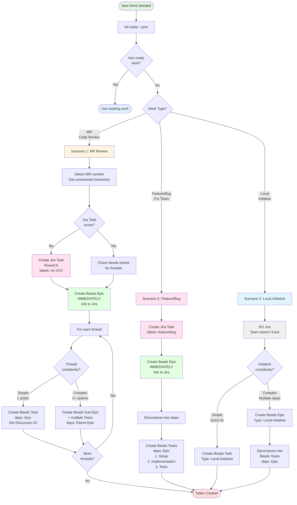

# Create Tasks

**Core**: Jira = team sync | Beads = local management

## Workflow



## Commands by Scenario

### Scenario 1: MR Review

```bash
# Check existing
bd ready --json
git branch --show-current
glab mr list --source-branch=$(git branch --show-current)
npm run gitlab:mr:get-unresolved -- --mr <MR_NUMBER>

# Check/Create Jira Task
CallMcpTool({
  server: "user-MCP_DOCKER",
  toolName: "jira_search",
  arguments: { jql: 'project = VP AND labels = mr-<MR> AND issuetype = Task AND status != Done' }
})

# Create Jira Task (if needed)
CallMcpTool({
  server: "user-MCP_DOCKER",
  toolName: "jira_create_issue",
  arguments: {
    project_key: "VP",
    summary: "[MR-<MR_NUMBER>] Code Review Round 1",
    issue_type: "Task",
    labels: ["mr-<MR_NUMBER>", "code-review", "round-1"]
  }
})

# Create Beads Epic IMMEDIATELY
PARENT_EPIC=$(bd create "Epic: Review MR-<MR_NUMBER>" --type=epic -p 1 --json | jq -r '.id')
bd update $PARENT_EPIC --description="Jira: VP-XXX
Type: MR Review"

# Per thread → Beads ticket
TASK=$(bd create "VP-YYY: ${thread.title}" --deps epic:$PARENT_EPIC -p 1 --json | jq -r '.id')
bd update $TASK --description="GitLab Discussion ID: ${thread.id}
File: ${thread.file}:${thread.line}"
```

### Scenario 2: Feature/Bug

```bash
# Create Jira Task
CallMcpTool({
  server: "user-MCP_DOCKER",
  toolName: "jira_create_issue",
  arguments: {
    project_key: "VP",
    summary: "Implement user auth",
    issue_type: "Task",
    labels: ["feature"]
  }
})

# Create Beads Epic IMMEDIATELY
PARENT_EPIC=$(bd create "Epic: VP-XXX: Implement user auth" --type=epic -p 1 --json | jq -r '.id')
bd update $PARENT_EPIC --description="Jira: VP-XXX
Type: Feature"

# Decompose into steps
TASK1=$(bd create "Setup DB schema" --deps epic:$PARENT_EPIC -p 1 --json | jq -r '.id')
TASK2=$(bd create "Create API endpoints" --deps epic:$PARENT_EPIC -p 1 --json | jq -r '.id')
TASK3=$(bd create "Add tests" --deps epic:$PARENT_EPIC -p 1 --json | jq -r '.id')
```

### Scenario 3: Local Initiative

```bash
# Simple → Task only
TASK=$(bd create "Fix typo in README" -p 1 --json | jq -r '.id')

# Complex → Epic + Tasks
EPIC=$(bd create "Epic: Refactor utils" --type=epic -p 1 --json | jq -r '.id')
TASK1=$(bd create "Extract functions" --deps epic:$EPIC -p 1 --json | jq -r '.id')
```

## Critical Rules

| ✅ DO                         | ❌ DON'T                    |
| ----------------------------- | --------------------------- |
| Jira Task → always Beads Epic | Create Jira Epic for Beads  |
| Link Beads only to Jira Task  | Link Beads to Jira Epic     |
| MR threads → separate tickets | Mix threads in one ticket   |
| Local work → no Jira          | Create Jira for small tasks |
| Store mapping in Beads        | Use JSON files for mapping  |

## References

- @005-beads.mdc - Core Beads workflow
- @mcp.md - MCP tools reference
