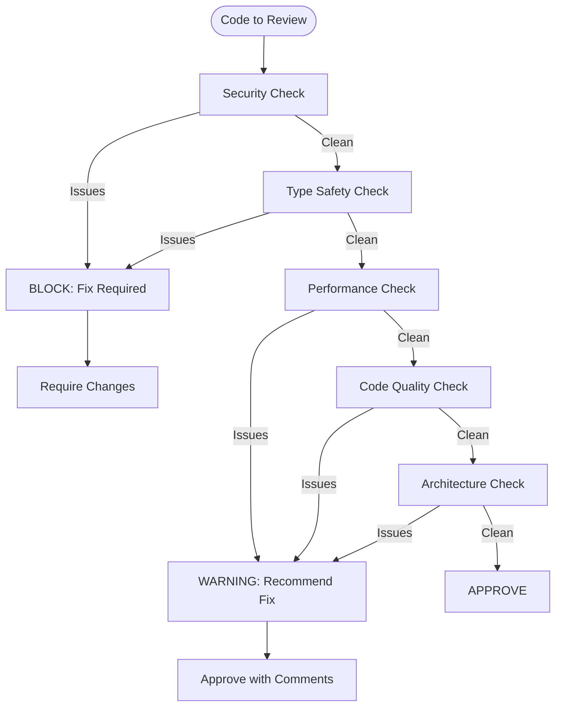

# Code Review Skill

## Trigger Conditions

- `/review` command executed
- PR/MR review requested
- Code quality assessment needed
- Pre-commit validation

## Review Categories

### 1. Type Safety (CRITICAL - Blocking)

| Check                                           | Pass              | Fail           |
| ----------------------------------------------- | ----------------- | -------------- |
| No `any` without eslint-disable + justification | `unknown` + guard | bare `any`     |
| No `as` assertions without type guard           | narrowing         | `as Type`      |
| Null checks after `?.`                          | explicit check    | implicit trust |
| Explicit return types on exports                | `: ReturnType`    | inferred       |

```typescript
// FLAG THIS
function getData(): any { ... }
const value = data as MyType

// ACCEPT THIS
function getData(): Data | null { ... }
const value = isMyType(data) ? data : null
```

### 2. Security (CRITICAL - Blocking)

| Check                           | Safe                     | Unsafe       |
| ------------------------------- | ------------------------ | ------------ |
| No hardcoded secrets            | env variables            | literals     |
| No `innerHTML`                  | DOMPurify or textContent | direct set   |
| Input validation                | Zod schema               | trust input  |
| No `eval()` or `new Function()` | alternatives             | dynamic code |

```typescript
// FLAG THIS
element.innerHTML = userInput
const token = 'sk-abc123'

// ACCEPT THIS
element.textContent = userInput
const token = import.meta.env.VITE_API_TOKEN
```

### 3. Performance (HIGH)

| Check                          | Good        | Bad          |
| ------------------------------ | ----------- | ------------ |
| No inline objects in JSX       | memoized    | `prop={{}}`  |
| useCallback for function props | stable      | inline arrow |
| useMemo for expensive ops      | cached      | computed     |
| React.memo for list items      | wrapped     | bare         |
| No barrel imports              | direct path | index export |

### 4. Code Quality (MEDIUM)

| Metric                | Limit     | Action           |
| --------------------- | --------- | ---------------- |
| File length           | 300 lines | Split            |
| Function length       | 30 lines  | Extract          |
| Nesting depth         | 3 levels  | Flatten          |
| Parameters            | 4 max     | Object/interface |
| Cyclomatic complexity | 10 max    | Simplify         |

### 5. Architecture (HIGH)

| Check                    | Valid                  | Invalid  |
| ------------------------ | ---------------------- | -------- |
| FSD layer imports        | pages->widgets->shared | reverse  |
| Generated code unchanged | pristine               | modified |
| No cross-layer imports   | respects boundaries    | violates |

## Review Workflow



## Output Format

```markdown
## Code Review Summary

**Status**: APPROVED | CHANGES REQUESTED | BLOCKED

**Files Reviewed**: 5
**Lines Changed**: +120 / -45

### Critical Issues (Must Fix)

1. **[SECURITY]** `src/api/auth.ts:45`

   - Issue: Hardcoded API key
   - Fix: Move to environment variable

2. **[TYPE SAFETY]** `src/hooks/useData.ts:23`
   - Issue: `any` type without justification
   - Fix: Add explicit type or `unknown` with guard

### Warnings (Recommended)

3. **[PERFORMANCE]** `src/components/Table.tsx:89`

   - Issue: Inline object in JSX prop
   - Fix: Extract to useMemo

4. **[QUALITY]** `src/utils/helpers.ts`
   - Issue: File exceeds 300 lines (342)
   - Fix: Split into focused modules

### Suggestions (Optional)

5. Consider using `useCallback` for `handleSubmit` to prevent re-renders

### Checklist

- [x] No security issues
- [x] Type safety maintained
- [ ] Performance optimized
- [x] Architecture respected
- [x] Tests included
```

## Quick Commands

```bash
# Run automated checks
npm run lint
npm run typecheck
npm run test -- --run

# Check specific patterns
grep -r "any" src/ --include="*.ts"
grep -r "innerHTML" src/ --include="*.tsx"
grep -r "as [A-Z]" src/ --include="*.ts"
```

## References

- `.cursor/BUGBOT.md` - Full pattern list
- `.cursor/rules/116-code-review.mdc` - Review standards
- `.cursor/rules/140-security.mdc` - Security guidelines
