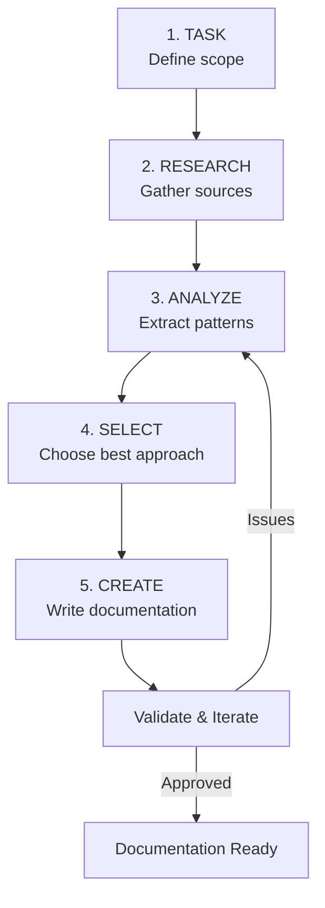

<!-- markdownlint-disable MD024 -->

# Documentation Workflow Skill

> **Universal skill for creating high-quality documentation with AI agents**
> Works with: Claude Code, Cursor, Windsurf, Copilot, and other AI-assisted IDEs

## Purpose

Complete documentation lifecycle: **Task → Research → Analyze → Select Best → Create**

This skill ensures documentation is:

- **Accurate** - based on current sources, not hallucinated
- **Relevant** - follows community best practices and latest standards
- **Well-structured** - uses proven templates and patterns
- **Actionable** - provides clear instructions and examples

## Trigger Conditions

- `/docs` or `/document` command executed
- Documentation request identified
- README/CONTRIBUTING/API docs needed
- Feature documentation requested
- Agent instructions/rules creation
- Any "write documentation for..." task

## Documentation Types

| Type | Use Case | Template |
|------|----------|----------|
| **Agent Rules** | Claude/Cursor instructions, .mdc files | `@agent-rules` |
| **API Docs** | Endpoint documentation, SDK guides | `@api-docs` |
| **Feature Docs** | User-facing feature explanations | `@feature-docs` |
| **Architecture** | System design, ADRs | `@architecture-docs` |
| **Guides** | How-to, tutorials, walkthroughs | `@guide-docs` |
| **Reference** | Quick reference, cheatsheets | `@reference-docs` |

## The 5-Phase Workflow



---

## Phase 1: TASK - Define Scope

### Questions to Answer

1. **What** needs documenting? (feature, API, rule, guide)
2. **Who** is the audience? (developers, AI agents, end users)
3. **Why** is this needed? (onboarding, reference, instruction)
4. **Where** will it live? (README, docs/, .cursor/rules/, CLAUDE.md)
5. **How detailed** should it be? (quick reference vs comprehensive guide)

### MCP Tools

```
hindsight.recall("similar documentation we created")
→ Find existing patterns in project
```

### Output: Task Definition

```yaml
documentation_task:
  type: [agent-rules|api-docs|feature-docs|guide|reference]
  subject: "What is being documented"
  audience: [ai-agent|developer|user|team]
  location: "path/to/docs"
  depth: [quick|standard|comprehensive]
  related_docs: ["existing/relevant/docs.md"]
```

---

## Phase 2: RESEARCH - Gather Sources

### Source Priority (Research Order)

```
1. Official Documentation (HIGHEST AUTHORITY)
   └─ context7.get-library-docs() for libraries
   └─ WebFetch for official sites

2. Source Code (TRUTH SOURCE)
   └─ Grep/Glob for implementation details
   └─ Read actual code, not assumptions

3. Project History (LOCAL CONTEXT)
   └─ hindsight.recall() for past decisions
   └─ Git history for evolution

4. Community Resources (BEST PRACTICES)
   └─ WebSearch for latest patterns
   └─ GitHub discussions/issues

5. AI Agent Docs (AGENT-SPECIFIC)
   └─ Anthropic docs for Claude
   └─ Cursor docs for Cursor rules
   └─ IDE-specific documentation
```

### MCP Research Tools

```
# Library documentation
context7.resolve-library-id("library-name")
context7.get-library-docs("/org/repo", topic: "specific-topic")

# Past patterns
hindsight.recall("how we documented X")
hindsight.recall("documentation patterns")

# External sources (with verification)
WebSearch("topic best practices 2026")
WebFetch(official_url, "extract documentation standards")

# Codebase research
Grep(pattern: "related_code", output_mode: "content")
Read(file_path: "source/to/document")
```

### Research Checklist

- [ ] Official docs consulted (context7 or WebFetch)
- [ ] Source code reviewed (actual implementation)
- [ ] Project history checked (hindsight)
- [ ] Community practices researched (WebSearch)
- [ ] Version/date verified (is info current?)
- [ ] Multiple sources cross-referenced

### Output: Research Notes

```markdown
## Research Summary

### Official Sources
- Source: [URL/path]
- Key findings: ...
- Version: X.Y.Z (current as of YYYY-MM)

### Implementation Details
- Files: [paths]
- Patterns used: ...

### Community Best Practices
- Pattern 1: ... (Source: ...)
- Pattern 2: ... (Source: ...)

### Gaps Identified
- Missing info on: ...
- Needs clarification: ...
```

---

## Phase 3: ANALYZE - Extract Patterns

### Analysis Framework

```
For each source, extract:
├─ KEY CONCEPTS: Core ideas that must be documented
├─ PATTERNS: Reusable approaches and structures
├─ ANTI-PATTERNS: What to avoid, common mistakes
├─ EXAMPLES: Good code/config examples
├─ EDGE CASES: Special scenarios to address
└─ DEPENDENCIES: Prerequisites and requirements
```

### MCP Analysis Tools

```
# Deep analysis with context preservation
pal.thinkdeep(
  step: "Analyzing documentation patterns",
  step_number: 1,
  total_steps: 3,
  findings: "[research summary]",
  next_step_required: true
)
→ Save continuation_id for later steps

# Multi-perspective analysis
pal.consensus(
  question: "Best structure for this documentation?",
  models: [
    { model: "gpt-5-codex", stance: "for" },
    { model: "claude-sonnet", stance: "against" }
  ]
)
```

### Pattern Extraction Template

```markdown
## Patterns Extracted

### Must Include
1. [Pattern] - Because [reason]
2. [Pattern] - Because [reason]

### Should Include
1. [Pattern] - Improves [what]
2. [Pattern] - Helps with [use case]

### Avoid
1. [Anti-pattern] - Causes [problem]
2. [Anti-pattern] - Leads to [issue]

### Structure Recommendation
- Format: [markdown|mdc|yaml|json]
- Sections: [list of sections]
- Length: [target word/line count]
```

---

## Phase 4: SELECT - Choose Best Approach

### Selection Criteria

| Criterion | Weight | Evaluation |
|-----------|--------|------------|
| **Accuracy** | CRITICAL | Is it factually correct? |
| **Completeness** | HIGH | Does it cover all use cases? |
| **Clarity** | HIGH | Is it easy to understand? |
| **Actionability** | HIGH | Can reader act on it? |
| **Maintainability** | MEDIUM | Is it easy to update? |
| **Consistency** | MEDIUM | Matches project style? |

### Decision Process

```
1. List candidate approaches (2-4 options)
2. Evaluate each against criteria
3. Consider audience needs
4. Check project conventions
5. Select and document reasoning
```

### MCP Selection Tools

```
# Get consensus on best approach
pal.consensus(
  continuation_id: "[from analysis]",
  question: "Which documentation approach is best?",
  findings: "[evaluated options]"
)

# Store decision
hindsight.retain(
  "Documentation decision: Chose [approach] because [reasons]"
)
```

### Output: Selection Rationale

```markdown
## Approach Selected

**Chosen**: [Approach name]

**Reasoning**:
1. Best fits audience ([who]) because [why]
2. Aligns with project conventions in [where]
3. Provides [specific benefit]

**Alternatives Considered**:
- [Alt 1]: Rejected because [reason]
- [Alt 2]: Rejected because [reason]

**Trade-offs Accepted**:
- [Trade-off 1] - Acceptable because [reason]
```

---

## Phase 5: CREATE - Write Documentation

### Structure Templates

#### For Agent Rules (.mdc files)

```markdown
---
description: '[One-line purpose]'
alwaysApply: [true|false]
globs: ['optional/file/patterns/**']
---

# [Rule Name]

> **Purpose**: [What this rule ensures]

## When to Apply
- [Trigger condition 1]
- [Trigger condition 2]

## Rules

### [Category 1]
- [Rule with example]
- [Rule with example]

### [Category 2]
| Do | Don't |
|----|-------|
| [Good] | [Bad] |

## Examples

```[language]
// Good
[code example]

// Bad
[anti-pattern]
```

## Related

- @[related-rule-1]
- @[related-rule-2]

```

#### For Feature Documentation

```markdown
# [Feature Name]

## Overview
[1-2 sentence description]

## Quick Start
```[language]
[minimal working example]
```

## Features

- **[Feature 1]**: [Description]
- **[Feature 2]**: [Description]

## Configuration

| Option | Type | Default | Description |
|--------|------|---------|-------------|
| [opt] | [type] | [default] | [desc] |

## Examples

### [Use Case 1]

[Example with explanation]

### [Use Case 2]

[Example with explanation]

## Troubleshooting

| Problem | Solution |
|---------|----------|
| [Issue] | [Fix] |

## Related

- [Link to related doc]

```

#### For API Documentation

```markdown
# [API/Endpoint Name]

## Overview
[Purpose and when to use]

## Endpoint
```

[METHOD] /path/to/endpoint

```

## Parameters
| Name | Type | Required | Description |
|------|------|----------|-------------|
| [param] | [type] | [yes/no] | [desc] |

## Request Example
```[language]
[request example]
```

## Response

```json
{
  "field": "description"
}
```

## Error Codes

| Code | Meaning | Solution |
|------|---------|----------|
| [code] | [meaning] | [how to fix] |

## Rate Limits

[If applicable]

## Examples

[Real-world usage examples]

```

### Writing Guidelines

#### DO:
- Start with the most important information
- Use concrete examples, not abstract descriptions
- Include both "happy path" and error handling
- Write for scanning (headers, bullets, tables)
- Keep sentences short and direct
- Use active voice ("Run the command" not "The command should be run")
- Version-tag time-sensitive information

#### DON'T:
- Assume reader knows context
- Use jargon without explanation
- Write walls of text
- Include outdated information
- Copy-paste without verification
- Skip error scenarios
- Forget to update related docs

### Quality Checklist

```markdown
## Documentation Quality Check

### Accuracy
- [ ] All code examples tested and working
- [ ] Version numbers current
- [ ] Links verified
- [ ] Facts cross-referenced with sources

### Completeness
- [ ] All use cases covered
- [ ] Error scenarios addressed
- [ ] Prerequisites listed
- [ ] Edge cases documented

### Clarity
- [ ] Jargon explained or linked
- [ ] Examples for complex concepts
- [ ] Logical flow of information
- [ ] Scannable structure (headers, bullets)

### Actionability
- [ ] Clear next steps
- [ ] Copy-pasteable examples
- [ ] Troubleshooting section
- [ ] Related resources linked

### Consistency
- [ ] Matches project style guide
- [ ] Terminology consistent
- [ ] Formatting uniform
- [ ] Links to related docs
```

---

## MCP Integration Summary

### Tools by Phase

| Phase | Primary MCP Tools |
|-------|-------------------|
| **Task** | `hindsight.recall` |
| **Research** | `context7`, `WebSearch`, `WebFetch`, `Grep`, `Read` |
| **Analyze** | `pal.thinkdeep`, `pal.consensus` |
| **Select** | `pal.consensus`, `hindsight.retain` |
| **Create** | `memory-bank.write`, `Edit`, `Write` |

### continuation_id Flow

```
Task Definition
    ↓
Research (gather sources)
    ↓
pal.thinkdeep(step: "analyze") → continuation_id: "doc-123"
    ↓
pal.thinkdeep(continuation_id: "doc-123", step: "select")
    ↓
pal.thinkdeep(continuation_id: "doc-123", step: "structure")
    ↓
Create documentation with full context
    ↓
hindsight.retain("Documentation completed: [summary]")
```

---

## Agent-Specific Instructions

### For Claude Code

```markdown
When executing /docs:
1. Use Read/Grep to understand existing codebase patterns
2. Use WebSearch for latest best practices (include year 2026)
3. Use context7 for library-specific documentation
4. Follow CLAUDE.md conventions for this project
5. Output in Russian for strategic docs, English for code comments
6. Run quality gates before considering complete
```

### For Cursor IDE

```markdown
When creating documentation:
1. Check .cursor/rules/ for existing conventions
2. Follow .mdc format for rule files
3. Use @mentions for cross-referencing
4. Apply alwaysApply: false unless rule is universal
5. Test in Cursor Composer before committing
```

### For Any AI Agent

```markdown
Universal documentation principles:
1. NEVER hallucinate - verify all facts with sources
2. ALWAYS provide examples - abstract descriptions are insufficient
3. INCLUDE error handling - happy path alone is incomplete
4. CITE sources - link to official docs when possible
5. VERSION info - include dates for time-sensitive content
6. TEST examples - all code must be runnable
7. ITERATE - documentation improves through feedback
```

---

## Quick Reference

### Command: /docs

```bash
# Full documentation workflow
/docs "Create agent rules for error handling"

# Specific documentation type
/docs --type=agent-rules "Authentication patterns"
/docs --type=api "REST endpoints for user service"
/docs --type=guide "How to set up local development"

# Quick reference mode
/docs --quick "TypeScript generics cheatsheet"
```

### Workflow Shortcuts

| Need | Command |
|------|---------|
| Agent rules | `/docs --type=agent-rules` |
| API docs | `/docs --type=api` |
| Feature docs | `/docs --type=feature` |
| How-to guide | `/docs --type=guide` |
| Quick reference | `/docs --quick` |
| Architecture decision | `/docs --type=adr` |

---

## Workflow Examples

### Example 1: Creating Agent Rules

**Input**: `/docs "Create rules for TanStack Query usage"`

**Workflow**:

1. **Task**: Agent rules for TanStack Query, audience: AI agents
2. **Research**: context7 for TanStack Query docs, project patterns
3. **Analyze**: Extract query patterns, mutation patterns, cache strategies
4. **Select**: .mdc format, organized by operation type
5. **Create**: Rule file with examples, do/don't tables

**Output**: `.cursor/rules/tanstack-query.mdc`

### Example 2: API Documentation

**Input**: `/docs --type=api "Document auth endpoints"`

**Workflow**:

1. **Task**: API docs for auth, audience: developers
2. **Research**: Read auth controller code, existing API docs
3. **Analyze**: Extract endpoints, params, responses, errors
4. **Select**: OpenAPI-style markdown format
5. **Create**: Comprehensive API reference

**Output**: `docs/api/auth.md`

---

## Metrics

| Metric | Target | Measurement |
|--------|--------|-------------|
| **Source verification** | 100% | All facts have sources |
| **Example coverage** | 100% | Every concept has example |
| **Error documentation** | 80%+ | Error scenarios covered |
| **Link validity** | 100% | All links working |
| **Freshness** | < 6 months | Content reviewed recently |

---

## Related Skills

- `@code-review` - For reviewing documentation PRs
- `@react-best-practices` - For React-specific docs
- `@execution-orchestrator` - For parallel doc generation
- `@skills-patterns` - For MCP workflow patterns

## References

- Anthropic Claude Documentation Guidelines
- Google Technical Writing Guide
- Microsoft Writing Style Guide
- Divio Documentation System (tutorials, how-to, reference, explanation)
