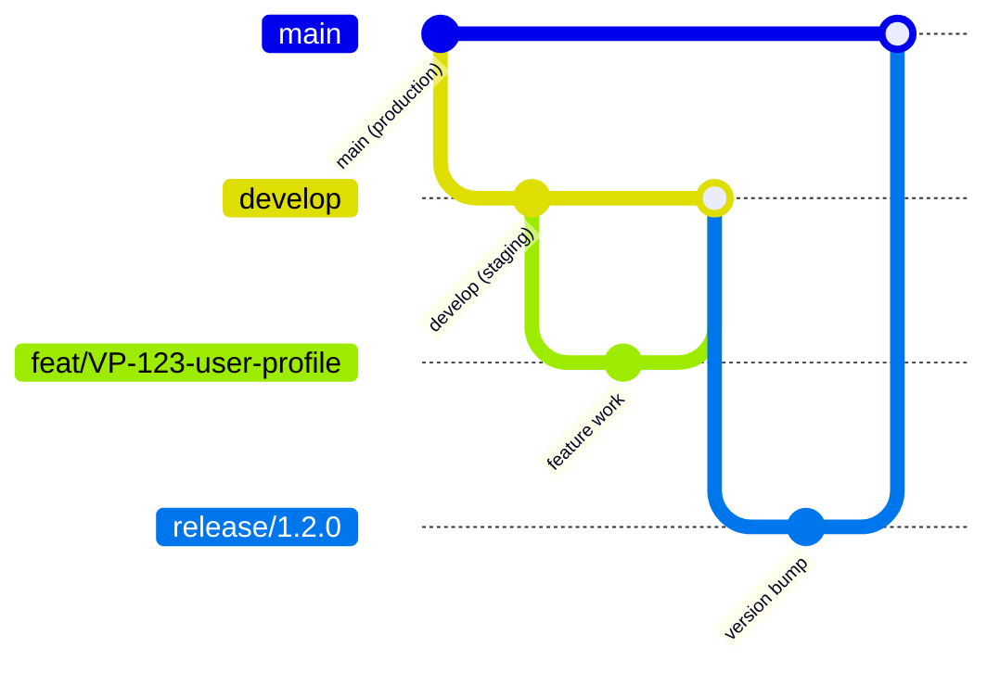
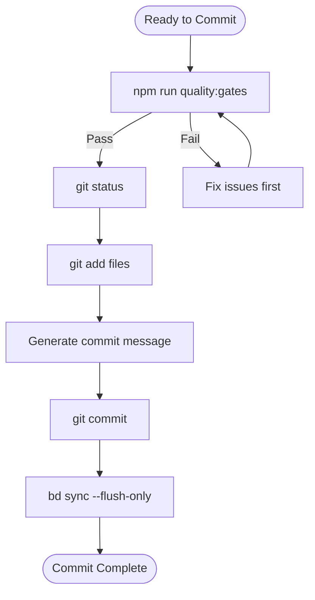
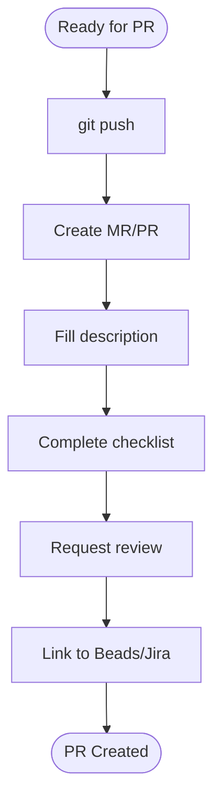

# Git Workflow Complete Guide

Comprehensive guide for version control, commits, pull requests, and branch strategy in the Customer Portal UI project.

## Table of Contents

1. [Branch Strategy](#branch-strategy)
2. [Commit Workflow](#commit-workflow)
3. [Pull Request Workflow](#pull-request-workflow)
4. [Development Process](#development-process)
5. [Quality Gates](#quality-gates)
6. [Troubleshooting](#troubleshooting)
7. [Quick Reference](#quick-reference)

## Branch Strategy

We use **Git Flow** with the following branch types:



### Branch Types

| Branch Type        | Purpose                    | Naming Convention              |
| ------------------ | -------------------------- | ------------------------------ |
| `main`             | Production code            | Fixed name                     |
| `develop`          | Development/staging branch | Fixed name                     |
| `feat/VP-XXX-*`    | Feature branches           | `feat/VP-123-feature-description` |
| `fix/VP-XXX-*`     | Bug fix branches           | `fix/VP-123-bug-description`     |
| `hotfix/VP-XXX-*`  | Emergency production fixes | `hotfix/VP-123-urgent-fix`       |
| `release/X.Y.Z`    | Release preparation        | `release/1.2.0`                |

### Creating a Branch

```bash
# Always branch from develop (except hotfixes from main)
git checkout develop
git pull upstream develop
git checkout -b feat/VP-123-user-profile

# For bug fixes
git checkout -b fix/VP-123-bug-description

# For hotfixes (from main)
git checkout main
git pull upstream main
git checkout -b hotfix/VP-123-urgent-fix
```

## Commit Workflow

### Pre-Commit Checklist (MANDATORY)

```
[ ] 1. Quality gates pass: npm run quality:gates
[ ] 2. No eslint-disable without justification
[ ] 3. No changes to src/shared/api/generated/
[ ] 4. Tests cover new functionality
[ ] 5. Beads task claimed (bd update <id> --status=in_progress)
```

### Workflow



### Steps

```bash
# 1. ALWAYS run quality gates first
npm run quality:gates

# 2. Check what's changed
git status

# 3. Stage files (be selective)
git add src/features/my-feature/
git add src/shared/ui/NewComponent.tsx

# 4. Commit with conventional format
git commit -m "feat(cargo): add bulk import functionality

- Add BulkImportModal component
- Create useBulkImport hook
- Add validation with Zod schema

Refs: VP-123"

# 5. Sync beads
bd sync --flush-only
```

### Conventional Commit Format

```
<type>(<scope>): <subject>

[optional body]

[optional footer]
```

#### Types

| Type       | When                 | Example                          |
| ---------- | -------------------- | -------------------------------- |
| `feat`     | New feature          | `feat(table): add column sorting` |
| `fix`      | Bug fix              | `fix(form): resolve validation error` |
| `refactor` | Code improvement     | `refactor(hooks): simplify useFilter logic` |
| `test`     | Tests                | `test(cargo): add integration tests` |
| `docs`     | Documentation        | `docs(readme): update setup instructions` |
| `chore`    | Maintenance          | `chore(deps): update dependencies` |
| `style`    | Formatting           | `style(lint): fix eslint warnings` |
| `perf`     | Performance          | `perf(table): virtualize large lists` |

#### Scope

Use FSD layer or feature name:

- **FSD layers:** `app`, `pages`, `widgets`, `shared`
- **Feature name:** `cargo`, `routes`, `auth`
- **Component name:** `table`, `form`, `modal`

#### Subject Rules

- **Imperative mood:** "add" not "added"
- **No period:** Don't end with period
- **Max 50 characters:** Keep concise
- **Lowercase:** Start with lowercase letter

### Commit Examples

#### Feature Commit

```
feat(cargo): add cargo request filtering

- Implement status filter with multi-select
- Add date range picker for created date
- Store filter state in URL params

Refs: VP-456
```

#### Bug Fix Commit

```
fix(table): resolve pagination reset on filter change

The table was resetting to page 1 when any filter changed,
even when the current page was still valid.

Fixed by checking if current page is within valid range
before resetting.

Fixes: VP-789
```

#### Refactor Commit

```
refactor(hooks): extract common query patterns

- Create useQueryWithError hook
- Extract retry logic to shared utility
- Update all API hooks to use new pattern

No functional changes.
```

### Commit Constraints

| NEVER                    | ALWAYS                  |
| ------------------------ | ----------------------- |
| `git commit --no-verify` | Run quality:gates first |
| `HUSKY=0 git commit`     | Let hooks run           |
| Commit failing tests     | Fix or update tests     |
| Commit console.log       | Remove before commit    |
| Commit without Refs      | Link to Beads/Jira task |

## Pull Request Workflow

### Prerequisites

```
[ ] All commits pushed to remote
[ ] Quality gates pass locally
[ ] Tests added/updated for changes
[ ] Self-reviewed diff
[ ] Beads task linked
```

### Workflow



### Creating a Pull Request

```bash
# 1. Ensure all changes committed
git status
# Should show: "nothing to commit, working tree clean"

# 2. Push to remote
git push -u origin feat/VP-123-feature-name

# 3. Create MR via GitLab CLI
glab mr create \
  --title "feat(cargo): add bulk import functionality" \
  --description "$(cat <<'EOF'
## Summary

Add ability to import multiple cargo requests from CSV file.

## Changes

- `src/features/bulk-import/` - New feature module
- `src/shared/utils/csv-parser.ts` - CSV parsing utility
- `src/widgets/cargo-toolbar/` - Add import button

## Type

- [x] Feature
- [ ] Bug fix
- [ ] Refactor
- [ ] Documentation

## Testing

- [x] Unit tests added
- [x] Manual testing completed
- [ ] E2E tests (not applicable)

## Checklist

- [x] Quality gates pass
- [x] Self-reviewed
- [x] Tests cover new functionality
- [x] Documentation updated (if needed)
- [x] No console.log or debugger
- [x] <400 lines changed

## Screenshots

(if UI changes)

## Related

- Refs: VP-123
- Depends on: !456 (if any)
EOF
)"

# 4. Sync beads
bd sync --flush-only
```

### PR Description Template

```markdown
## Summary

[1-2 sentences describing what this PR does]

## Changes

- `path/to/file.tsx` - Description of change
- `path/to/another.ts` - Description of change

## Type

- [ ] Feature
- [ ] Bug fix
- [ ] Refactor
- [ ] Documentation
- [ ] Performance
- [ ] Test

## Testing

- [ ] Unit tests added/updated
- [ ] Manual testing completed
- [ ] E2E tests (if applicable)

## Checklist

- [ ] Quality gates pass (`npm run quality:gates`)
- [ ] Self-reviewed diff
- [ ] Tests cover new functionality
- [ ] No TODO comments without ticket reference
- [ ] No console.log or debugger statements
- [ ] <400 lines changed (split if larger)
- [ ] Documentation updated (if needed)

## Screenshots

(Required for UI changes)

## Related

- Refs: VP-XXX
- Fixes: VP-YYY (if bug fix)
- Depends on: !ZZZ (if blocked by another MR)
```

### Size Guidelines

| Lines Changed | Status     | Action             |
| ------------- | ---------- | ------------------ |
| <200          | Ideal      | Good for review    |
| 200-400       | Acceptable | Consider splitting |
| 400-600       | Large      | Split if possible  |
| >600          | Too large  | Must split         |

### PR Review Process

#### Self Review

1. Review your own code first
2. Run `npm run quality:gates` locally
3. Check for obvious issues
4. Ensure tests are comprehensive

#### Requesting Review

```bash
# Assign reviewers
glab mr update <mr-id> --assignee @reviewer1 --reviewer @reviewer2

# Add labels
glab mr update <mr-id> --label "needs-review"

# Link to Jira (via MCP)
# Use jira_update_issue to add MR link
```

#### Automated Checks

- CI pipeline must pass
- All quality gates must pass
- Code coverage must not decrease

#### Peer Review

Use available prompts for comprehensive review:

- `.cursor/prompts/mr-code-review.md` - Full MR code review
- `.cursor/prompts/mr-comments-workflow.md` - Process existing comments
- `.cursor/prompts/quality-gates.md` - Run quality gates
- `.cursor/prompts/gitlab-update-mr-description.md` - Update MR description

#### Review Checklist

**Functionality:**

- [ ] Code fulfills the requirements
- [ ] Edge cases handled
- [ ] No regressions introduced

**Code Quality:**

- [ ] Follows SOLID principles
- [ ] No code duplication
- [ ] Proper error handling
- [ ] Type safety maintained

**Performance:**

- [ ] No unnecessary re-renders
- [ ] Efficient algorithms used
- [ ] Bundle size impact acceptable

**Security:**

- [ ] No security vulnerabilities
- [ ] Sensitive data protected
- [ ] Input validation present

### Handling Review Feedback

#### If Changes Requested

```bash
# Make fixes
# Commit with descriptive message
git commit -m "fix(cargo): address review feedback

- Rename variable for clarity
- Add error handling for edge case
- Update test assertions"

# Push
git push

# Comment on MR
glab mr note <mr-id> --message "Addressed feedback, ready for re-review"
```

#### If Approved

```bash
# Merge (if you have permission)
glab mr merge <mr-id> --squash

# Or wait for maintainer to merge

# Update Beads
bd close <task-id>
bd sync --flush-only
```

### PR Constraints

| NEVER                       | ALWAYS                  |
| --------------------------- | ----------------------- |
| Merge own PR without review | Get at least 1 approval |
| Merge with failing CI       | Wait for green pipeline |
| Force push after review     | Create new commits      |
| Create PR >600 lines        | Split into smaller PRs  |
| Skip checklist items        | Complete all checkboxes |

## Development Process

### Setup

1. **Fork the repository**

   ```bash
   git clone https://github.com/your-username/Front.git
   cd Front
   ```

2. **Add upstream remote:**

   ```bash
   git remote add upstream https://github.com/eurochem/Front.git
   ```

3. **Install dependencies:**

   ```bash
   npm install
   ```

4. **Set up environment:**

   ```bash
   cp .env.example .env.local
   echo "ENABLE_MOCKS=true" >> .env.local
   ```

5. **Generate API types:**

   ```bash
   npm run codegen
   ```

6. **Start development server:**

   ```bash
   npm run dev
   ```

### Development Workflow

1. **Create feature branch:**

   ```bash
   git checkout develop
   git pull upstream develop
   git checkout -b feat/VP-123-user-profile
   ```

2. **Make changes** following coding standards

3. **Test your changes:**

   ```bash
   npm run quality:gates  # Runs all quality checks
   ```

4. **Commit** using conventional commits

5. **Push and create PR:**

   ```bash
   git push origin feat/VP-123-user-profile
   ```

## Quality Gates

### What Quality Gates Check

```bash
npm run quality:gates
```

Runs the following checks:

```bash
npm run lint          # ESLint errors
npm run typecheck     # TypeScript errors
npm run test -- --run # Test failures
npm run build         # Build errors
```

### Troubleshooting Quality Gate Failures

#### ESLint Errors

```bash
# View errors
npm run lint

# Auto-fix what can be fixed
npm run lint -- --fix

# Common fixes
npm run lint -- --fix  # Fixes imports, formatting, simple issues
```

#### TypeScript Errors

```bash
# View errors
npm run typecheck

# Review and fix type issues manually
```

#### Test Failures

```bash
# Run tests
npm run test -- --run

# Run specific test file
npm run test -- src/features/cargo/__tests__/CargoTable.test.tsx

# Run tests in watch mode for debugging
npm run test
```

#### Build Errors

```bash
# Run build
npm run build

# Check for obvious issues first
npm run lint
npm run typecheck
```

### Commit Hook Failures

```bash
# Check what failed
git status

# Do NOT bypass hooks
# Fix the issue instead
npm run lint -- --fix
npm run quality:gates
git commit -m "..."
```

## Task Management

### Beads Integration

```bash
# Check ready work
bd ready --json

# Claim task
bd update <id> --status=in_progress

# Work on task...

# Close and sync
bd close <id> --reason="Completed"
bd sync --flush-only
```

### Session Workflow

**Start:**

```bash
bd ready --json                      # Check ready work
bd update <id> --status=in_progress  # Claim task
```

**End (MANDATORY):**

```bash
bd close <id>        # Close completed
bd sync --flush-only # Sync with git
npm run quality:gates # Run quality checks
git add .
git commit -m "message"
git push
```

## Troubleshooting

### Quality Gates Fail

```bash
# Check specific issue
npm run lint          # ESLint errors
npm run typecheck     # TypeScript errors
npm run test -- --run # Test failures

# Fix and retry
npm run quality:gates
```

### Commit Hook Fails

```bash
# Check what failed
git status

# Do NOT bypass hooks - they protect code quality
# Fix the issue instead
npm run lint -- --fix
npm run quality:gates
git commit -m "..."
```

### CI Pipeline Fails

1. **Check the pipeline logs** in GitLab
2. **Common issues:**
   - Tests failing
   - Linting errors
   - Type errors
   - Build errors
3. **Fix locally** and push again
4. **Do NOT merge** with failing pipeline

### Push Fails

```bash
# Check your branch is up to date
git pull origin feat/VP-123-feature-name

# Resolve any conflicts
# Then try again
git push
```

### Cannot Push to Protected Branches

```
# You cannot push directly to main or develop
# This is a safety measure

# Instead, create a merge request from your feature branch
git push origin feat/VP-123-feature-name
glab mr create
```

## Quick Reference

### Common Commands

| Task                         | Command                                |
| ---------------------------- | -------------------------------------- |
| Create feature branch        | `git checkout -b feat/VP-123-desc`    |
| Check status                 | `git status`                           |
| Stage files                  | `git add src/features/`                |
| Commit                       | `git commit -m "feat(...): message"`   |
| Push branch                  | `git push -u origin feat/VP-123-desc` |
| Sync with develop            | `git pull upstream develop`            |
| Create MR                    | `glab mr create`                       |
| Run quality gates            | `npm run quality:gates`                |
| Run tests                    | `npm run test`                         |
| Claim Beads task             | `bd update <id> --status=in_progress`  |
| Close Beads task             | `bd close <id>`                        |
| Sync Beads                   | `bd sync --flush-only`                 |

### What NOT to Do

- **Push directly to** `main` or `develop`
- **Use** `git push --no-verify`
- **Commit sensitive data** (keys, passwords)
- **Skip quality checks** with `HUSKY=0`
- **Leave console.log** or debugger statements
- **Disable ESLint rules** without justification
- **Merge with failing** CI pipeline
- **Create PR >600 lines** without splitting

## Definition of Done

Before marking a task as complete:

- [ ] Code complete and working
- [ ] Unit tests written and passing
- [ ] Integration tests updated
- [ ] Documentation updated
- [ ] Code reviewed and approved
- [ ] No linting errors
- [ ] Build successful
- [ ] Manually tested
- [ ] Quality gates pass
- [ ] Beads task closed
- [ ] Merged to develop

## Related Documentation

- **[CONTRIBUTING.md](/CONTRIBUTING.md)** - Full contributing guidelines
- **[DEVELOPMENT.md](../DEVELOPMENT.md)** - Development setup guide
- **[Code Review Guide](code-review-guide.md)** - Code review workflows
- **[Development Workflow](development-workflow.md)** - MCP and task management
- **[.cursor/rules/](../../.cursor/rules/)** - Cursor rules for development

---

Last updated: January 2026
