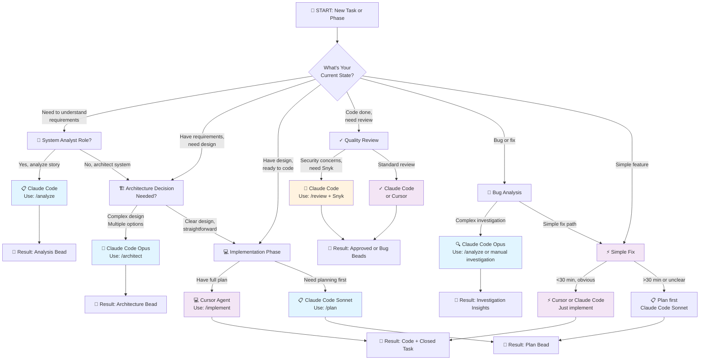

# IDE Decision Flowchart: When to Use Claude Code vs Cursor

> **TL;DR:** Need architecture/deep thinking? → **Claude Code Opus**. Have a plan, need code fast? → **Cursor Agent**

---

## Visual Decision Flowchart



---

## Quick Reference Table

Use this when you need a 30-second decision:

| Task Type | Primary IDE | Model/Mode | When to Use | Example |
|-----------|------------|-----------|-----------|---------|
| **Analyze Requirements** | Claude Code | Opus | Breaking down user stories, understanding scope | "Add dark mode support" → extract acceptance criteria |
| **Architecture Design** | Claude Code | Opus | Complex decisions, system design, multiple approaches | "How to structure theme system?" |
| **Make a Plan** | Claude Code | Sonnet | Detailed planning, create implementation roadmap | Break architecture into tasks |
| **Implement Feature** | Cursor | Agent | Have plan, write code, iterate fast | Build components, write tests |
| **Debug Complex Bug** | Claude Code | Opus | Investigation needed, trace root cause | "Why is auth flow failing randomly?" |
| **Quick Bug Fix** | Cursor | Agent | Obvious fix path, <30 minutes | Fix typo, update color, add missing prop |
| **Code Review** | Claude Code | Opus + Sonnet | Security/architecture concerns, multiple eyes | PR verification swarm |
| **Test Generation** | Cursor | Agent | Write tests quickly, iterate | Generate test suite for component |
| **Performance Optimize** | Claude Code | Opus | Complex investigation, multiple solutions | "Why is dashboard slow?" |
| **Simple Feature** | Either | - | Clear requirement, obvious path | Add missing button to form |

---

## Decision Rules (The 80% Heuristic)

### Rule 1: If You Need to THINK → Claude Code

```
"I need to figure this out"
"This is complicated"
"I'm not sure what's wrong"
"Multiple approaches exist"
→ Claude Code (Opus for deep analysis)
```

**Why:** Claude Code Opus provides deep reasoning, architectural analysis, and can investigate complex problems.

---

### Rule 2: If You Have a PLAN → Cursor

```
"I know what to do"
"Just need to implement"
"Have clear requirements"
"It's straightforward"
→ Cursor Agent
```

**Why:** Cursor Agent is optimized for code generation, fast iteration, and quality gate automation.

---

### Rule 3: If You Need MULTIPLE EXPERT OPINIONS → Claude Code

```
"Security concerns?"
"Architectural decisions?"
"Design trade-offs?"
"Senior review needed?"
→ Claude Code (Opus with /review)
```

**Why:** Claude Code has verification swarms (Coder + Security + Architecture agents).

---

### Rule 4: If It's UNDER 30 MINUTES → Probably Cursor

```
"Fix typo"
"Update color"
"Add PropTypes"
"Change constant"
"One-line fix"
→ Cursor (no planning needed)
```

**Why:** Cursor's iteration speed wins for simple fixes. Claude Code is overkill.

---

### Rule 5: If You're SWITCHING BETWEEN IDEs → Use Handoff Protocol

```
Claude Code → Analysis done → Update context-handoff.md
              ↓
           Context saved
              ↓
         Switch to Cursor → Read handoff → Continue implementation
```

**Why:** Prevents context loss, maintains continuity across IDE switches.

---

## IDE Strengths Comparison

### Claude Code Strengths

✅ **Deep Analysis**

- Complex investigations
- Root cause analysis
- Architectural decisions
- Security reviews

✅ **Model Switching**

- Opus for critical thinking
- Sonnet for planning
- Haiku for fast iteration

✅ **Advanced Features**

- Hindsight memory (multi-session context)
- Perles orchestration (multi-agent workflows)
- Verification swarms (3-agent QA)
- Context7 library docs

✅ **Exploration**

- WebSearch for external info
- Comprehensive analysis
- Pattern discovery

### Cursor Strengths

✅ **Code Generation**

- Fast component generation
- Test suite creation
- Implementation speed

✅ **Iteration**

- Quick feedback loop
- Automode for repeated tasks
- Quality gate automation

✅ **Developer Experience**

- Familiar IDE (VS Code-like)
- Natural coding workflow
- Tab organization

✅ **Beads Integration**

- Seamless task tracking
- Inline issue management
- Quality gates in workflow

---

## Common Scenarios: Which IDE?

### Scenario 1: "I need to build a new feature"

```
Requirement: "Add user preferences modal"

Step 1: Understand → Claude Code /analyze
  • Break down requirements
  • Identify unknowns
  • Create analysis bead

Step 2: Design → Claude Code /architect
  • Design modal structure
  • Decide data flow
  • Create architecture bead

Step 3: Plan → Claude Code /plan
  • Create task breakdown
  • Identify test cases
  • Create plan bead

Step 4: Implement → Cursor /implement
  • Write modal component
  • Write tests
  • Quality gates pass

Step 5: Review → Claude Code /review
  • Verify against requirements
  • Check security
  • Approve or feedback
```

**IDEs Used:** Claude Code (3 phases) → Cursor (1 phase) → Claude Code (1 phase)
**Time:** 4-8 hours (complex feature with architectural decisions)

---

### Scenario 2: "I have a clear spec, just implement"

```
Requirement: "Add 'Copy to Clipboard' button on user profile"
(Clear spec, simple implementation)

Step: Implement → Cursor /implement
  • Add button component
  • Write copy-to-clipboard hook
  • Add tests
  • Quality gates pass
```

**IDEs Used:** Cursor only
**Time:** 30 minutes

---

### Scenario 3: "Performance is bad, investigate"

```
Problem: "Dashboard loads slowly"

Step 1: Investigate → Claude Code (Opus)
  • Trace performance bottleneck
  • Analyze bundle size
  • Profile rendering
  • Create investigation insights

Step 2: Plan → Claude Code (Sonnet)
  • Design optimization strategy
  • Break into tasks
  • Create plan

Step 3: Implement → Cursor
  • Implement optimizations
  • Run performance tests
  • Verify improvement
```

**IDEs Used:** Claude Code (2 phases) → Cursor (1 phase)
**Time:** 2-4 hours

---

### Scenario 4: "Bug in production, need quick fix"

```
Bug: "Login button doesn't respond"

Analysis: Obvious fix (event handler missing)

Step: Fix → Cursor (no thinking needed)
  • Add event handler
  • Quick test
  • Done
```

**IDEs Used:** Cursor only
**Time:** 10 minutes

---

### Scenario 5: "Architecture decision needed"

```
Question: "Should we migrate from Redux to Zustand?"

Step 1: Analysis → Claude Code (Opus)
  • Compare architectures
  • Evaluate trade-offs
  • Risk assessment
  • Migration cost analysis

Step 2: Decision → Claude Code (deep thinking)
  • Make recommendation
  • Create ADR (Architecture Decision Record)
```

**IDEs Used:** Claude Code only
**Time:** 1-2 hours (decision + documentation)

---

## Model Selection by Task

### When to Use Opus (Claude Code)

- ✅ Architecture decisions
- ✅ Complex bug investigations
- ✅ Security analysis
- ✅ Performance optimization
- ✅ Code review (critical)
- ✅ System design

**Cost:** Higher token usage, but deep analysis worth it

### When to Use Sonnet (Claude Code or Cursor)

- ✅ Planning and task breakdown
- ✅ Implementation planning
- ✅ Standard code review
- ✅ Test planning

**Cost:** Medium tokens, good balance of quality and speed

### When to Use Haiku (Claude Code only)

- ✅ Quick research
- ✅ Fast prototyping
- ✅ Learning codebase patterns

**Cost:** Lowest tokens, acceptable quality

### When to Use Cursor Agent

- ✅ Implementation (fastest iteration)
- ✅ Test generation
- ✅ Quick fixes
- ✅ Refactoring with automode

**Cost:** Fixed (no token metering), optimized for speed

---

## Decision Trees by Phase

### Phase 1: Analysis

```
"Do I understand the requirement?"
├─ No → Claude Code /analyze (Opus)
└─ Yes → Skip to Phase 2
```

### Phase 2: Architecture

```
"Is the design clear?"
├─ No → Claude Code /architect (Opus)
├─ Yes, simple → Skip to Phase 3
└─ Yes, complex → Claude Code /architect (Opus for validation)
```

### Phase 3: Planning

```
"Do I have a step-by-step plan?"
├─ No → Claude Code /plan (Sonnet)
└─ Yes → Skip to Phase 4
```

### Phase 4: Implementation

```
"Is the implementation path clear?"
├─ Yes → Cursor /implement (Agent)
├─ <30 min fix → Cursor (direct)
└─ Uncertain → Back to Phase 3
```

### Phase 5: Review

```
"Ready for review?"
├─ Yes, complex → Claude Code /review (Opus + Sonnet)
├─ Yes, simple → Cursor (auto quality gates)
└─ No → Back to Phase 4
```

---

## Quick Start: New to Claude Code + Cursor?

### If you're a **Developer**

1. **First task:** Use Cursor (what you know)
2. **Second task:** Try Claude Code /review
3. **Third task:** Use full Claude Code → Cursor flow
4. Learn IDE switching with context handoff

### If you're an **Analyst**

1. **First task:** Learn Claude Code /analyze
2. **Second task:** Practice /architect
3. **Third task:** Link Beads to analysis

### If you're a **QA/Tester**

1. **First task:** Use Cursor for test generation
2. **Second task:** Try MSW mock generation
3. **Third task:** Complex test design in Claude Code

---

## When in Doubt

**Ask yourself these questions (in order):**

1. **Is there ambiguity?** → Claude Code (think first)
2. **Do I need security/architecture review?** → Claude Code (Opus)
3. **Do I have a clear plan?** → Cursor (execute fast)
4. **Is it a complex investigation?** → Claude Code (deep analysis)
5. **Am I switching between IDEs?** → Use handoff protocol
6. **Is it <30 minutes and obvious?** → Cursor (no overhead)

---

## Next Steps

- **See also:** `Feature-Matrix.md` - Complete capability comparison
- **See also:** `Context-Handoff-Protocol.md` - Safe IDE transitions
- **See also:** `Role-Based-Guides/` - Your role-specific guide
- **See also:** `SDLC-PATTERNS/` - Full phase breakdown

---

**Remember:** This isn't "which IDE is better." Each is best for different tasks. The dual-IDE workflow leverages both strengths.

🎯 **Final Rule:** When you're thinking → Claude Code. When you're building → Cursor.
