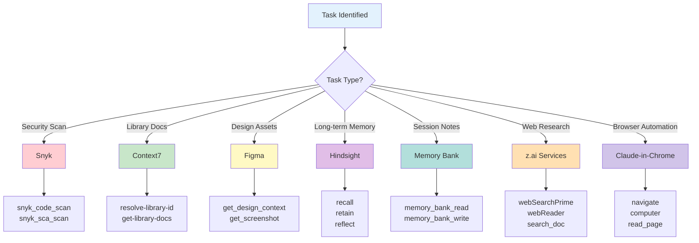
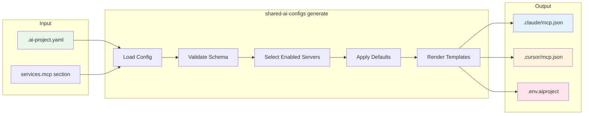
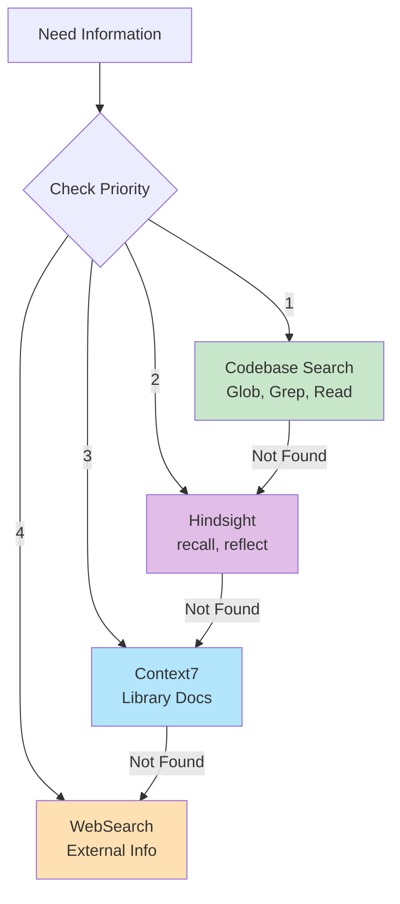

# MCP Configuration Guide

> **Version:** 1.0.0
> **Last Updated:** 2026-01-22

## Overview

Model Context Protocol (MCP) servers extend AI assistants with specialized capabilities. This guide covers configuration of MCP servers through `shared-ai-configs`.

## MCP Server Types

MCP servers connect via two transport mechanisms:

### 1. HTTP-based Servers (Streamable HTTP)

Connect via URL endpoint. Ideal for cloud-hosted services.

```json
{
  "figma": {
    "url": "https://mcp.figma.com/mcp",
    "headers": {}
  }
}
```

**Characteristics:**

- Always-on cloud services
- Authentication via headers (Bearer tokens)
- No local process management
- Lower latency for stateless queries

### 2. stdio-based Servers (Local Process)

Spawn as local processes communicating via stdin/stdout.

```json
{
  "snyk": {
    "command": "npx",
    "args": ["-y", "snyk@latest", "mcp", "-t", "stdio"],
    "env": {}
  }
}
```

**Characteristics:**

- Run locally on developer machine
- Full filesystem/tool access
- Environment variables for configuration
- Process lifecycle managed by IDE

## Server Selection Flow



## Configuration in .ai-project.yaml

### Basic MCP Configuration

```yaml
services:
  mcp:
    hindsight:
      enabled: true
    snyk:
      enabled: true
    context7:
      enabled: true
    memory_bank:
      enabled: true
    figma:
      enabled: true
    browser:
      enabled: true # Enables z.ai suite: web-search, web-reader, zread
```

### Advanced Configuration with Custom Settings

```yaml
services:
  mcp:
    hindsight:
      enabled: true
      # Custom endpoint (default: http://localhost:8888/mcp/alice/)
      url: 'http://custom-host:9999/mcp/alice/'

    snyk:
      enabled: true
      # Custom args override defaults
      args: ['-y', 'snyk@6.0.0', 'mcp', '-t', 'stdio']

    context7:
      enabled: true
      # Explicit API key env var reference
      api_key_env: 'CONTEXT7_API_KEY'

    memory_bank:
      enabled: true
      env:
        MEMORY_BANK_ROOT: '.custom-memory'
```

## Configuration to Generation Flow



### Generation Process Details

1. **Load Config** - Parse `.ai-project.yaml`
2. **Validate Schema** - Check against JSON Schema
3. **Select Enabled Servers** - Filter by `enabled: true`
4. **Apply Defaults** - Merge with built-in server configs
5. **Render Templates** - Generate IDE-specific JSON files

## Generated Output

### .claude/mcp.json

Claude Code MCP configuration:

```json
{
  "mcpServers": {
    "hindsight-alice": {
      "url": "http://localhost:8888/mcp/alice/",
      "headers": {}
    },
    "Snyk": {
      "command": "npx",
      "args": ["-y", "snyk@latest", "mcp", "-t", "stdio"]
    },
    "Context7": {
      "command": "npx",
      "args": ["-y", "@upstash/context7-mcp"],
      "env": {
        "CONTEXT7_API_KEY": "${CONTEXT7_API_KEY}"
      }
    }
  }
}
```

### .cursor/mcp.json

Cursor IDE MCP configuration (identical format):

```json
{
  "mcpServers": {
    "hindsight-alice": {
      "url": "http://localhost:8888/mcp/alice/",
      "headers": {}
    }
  }
}
```

### .env.aiproject

API keys template (add to `.gitignore`):

```bash
# MCP Server API Keys
# Copy to .env.local and fill in values

# Context7 (Upstash)
CONTEXT7_API_KEY=

# z.ai Services (web-search, web-reader, zread, zai-mcp-server)
Z_AI_API_KEY=

# Figma (optional - uses OAuth flow)
FIGMA_API_KEY=

# Snyk (optional - uses CLI auth)
SNYK_TOKEN=
```

## Server Reference Table

| Server               | Type  | Config Key    | Use For                           | API Key Env        | Default Port |
| -------------------- | ----- | ------------- | --------------------------------- | ------------------ | ------------ |
| **Hindsight**        | HTTP  | `hindsight`   | Long-term memory, decision recall | None (local)       | 8888         |
| **Snyk**             | stdio | `snyk`        | Security scanning (SAST, SCA)     | `SNYK_TOKEN`       | N/A          |
| **Context7**         | stdio | `context7`    | Library documentation lookup      | `CONTEXT7_API_KEY` | N/A          |
| **Memory Bank**      | stdio | `memory_bank` | Session notes, project memory     | None               | N/A          |
| **Figma**            | HTTP  | `figma`       | Design-to-code, screenshots       | `FIGMA_API_KEY`    | N/A          |
| **zai-mcp-server**   | stdio | `browser`     | Image analysis, OCR               | `Z_AI_API_KEY`     | N/A          |
| **web-search-prime** | HTTP  | `browser`     | Web search                        | `Z_AI_API_KEY`     | N/A          |
| **web-reader**       | HTTP  | `browser`     | URL content extraction            | `Z_AI_API_KEY`     | N/A          |
| **zread**            | HTTP  | `browser`     | GitHub repo search                | `Z_AI_API_KEY`     | N/A          |

## Server Capabilities

### Hindsight (Memory Server)

| Tool      | Purpose                          | Example                             |
| --------- | -------------------------------- | ----------------------------------- |
| `recall`  | Retrieve past decisions/patterns | `recall("API error handling")`      |
| `retain`  | Store important information      | `retain("Use X pattern because Y")` |
| `reflect` | Synthesize complex decisions     | `reflect("Architecture options")`   |

### Snyk (Security Scanner)

| Tool                  | Purpose                            | Severity Levels             |
| --------------------- | ---------------------------------- | --------------------------- |
| `snyk_code_scan`      | SAST - source code vulnerabilities | low, medium, high           |
| `snyk_sca_scan`       | SCA - dependency vulnerabilities   | low, medium, high, critical |
| `snyk_iac_scan`       | IaC - infrastructure misconfigs    | low, medium, high, critical |
| `snyk_container_scan` | Container image vulnerabilities    | low, medium, high, critical |

### Context7 (Documentation)

| Tool                 | Purpose                 | Example                                                  |
| -------------------- | ----------------------- | -------------------------------------------------------- |
| `resolve-library-id` | Find library identifier | `resolve-library-id("tanstack query")`                   |
| `get-library-docs`   | Fetch documentation     | `get-library-docs("/tanstack/query", topic="mutations")` |

### Figma (Design Integration)

| Tool                 | Purpose                    | Example                                               |
| -------------------- | -------------------------- | ----------------------------------------------------- |
| `get_design_context` | Generate code from design  | `get_design_context(nodeId="123:456", fileKey="abc")` |
| `get_screenshot`     | Capture design screenshot  | `get_screenshot(nodeId="123:456", fileKey="abc")`     |
| `get_metadata`       | Get design structure (XML) | `get_metadata(nodeId="0:1", fileKey="abc")`           |

### Memory Bank (Project Notes)

| Tool                | Purpose           | Example                                                                          |
| ------------------- | ----------------- | -------------------------------------------------------------------------------- |
| `memory_bank_read`  | Read stored notes | `memory_bank_read(projectName="Front", fileName="api-patterns.md")`              |
| `memory_bank_write` | Store new notes   | `memory_bank_write(projectName="Front", fileName="decisions.md", content="...")` |
| `list_projects`     | List all projects | `list_projects()`                                                                |

## Priority Order for Tool Selection

When multiple tools could solve a task, use this priority:



1. **Codebase** - Always check existing patterns first
2. **Hindsight** - Past decisions and project context
3. **Context7** - Official library documentation
4. **WebSearch** - External resources (last resort)

## Environment Setup

### Required Environment Variables

```bash
# In your shell profile (~/.zshrc or ~/.bashrc)

# Context7 - Required for library docs
export CONTEXT7_API_KEY="your-upstash-key"

# z.ai Services - Required for web search/reader
export Z_AI_API_KEY="your-zai-key"
```

### Verification Commands

```bash
# Check all required env vars
npx shared-ai-configs doctor

# Test specific server
curl -I http://localhost:8888/health  # Hindsight
npx snyk auth                         # Snyk CLI auth
```

## Troubleshooting

### Common Issues

| Issue                   | Cause                  | Solution                             |
| ----------------------- | ---------------------- | ------------------------------------ |
| "Server not responding" | Process not running    | Check `docker ps` or restart IDE     |
| "Tool not found"        | Wrong server/tool name | Verify exact names in docs           |
| "Rate limit exceeded"   | Too many requests      | Wait 60s, use caching                |
| "Authentication failed" | Missing/expired key    | Check env vars, re-auth              |
| "Connection refused"    | Service not started    | Start Hindsight: `docker-compose up` |

### Fallback Strategies

| MCP Tool        | Fallback When Unavailable             |
| --------------- | ------------------------------------- |
| **Context7**    | WebSearch + `node_modules` inspection |
| **Hindsight**   | Grep codebase, check code comments    |
| **Snyk**        | Run `npm audit` locally               |
| **Figma**       | Request screenshots from user         |
| **Memory Bank** | Use local `.md` files temporarily     |

## Configuration Examples

### Minimal Setup (Essential Only)

```yaml
services:
  mcp:
    hindsight:
      enabled: true
    context7:
      enabled: true
```

### Frontend Project (Full Stack)

```yaml
services:
  mcp:
    hindsight:
      enabled: true
    snyk:
      enabled: true
    context7:
      enabled: true
    memory_bank:
      enabled: true
    figma:
      enabled: true
    browser:
      enabled: true
```

### Backend/CLI Project (Security Focus)

```yaml
services:
  mcp:
    hindsight:
      enabled: true
    snyk:
      enabled: true
    context7:
      enabled: true
```

## Related Documentation

- [Architecture Overview](./ARCHITECTURE.md)
- [MCP Troubleshooting Rules](../core/mcp/mcp-troubleshooting.mdc)
- [Tool Selection Rules](../core/mcp/tool-selection.mdc)
