# Vibe-Coding Guide

> **Vibe-Coding** = You describe what you need, AI writes the code.
>
> Works for everyone: analyst, PM, developer, designer — anyone.
> No programming knowledge needed. You just need to explain the task.

---

## Choose Your Workflow

| Option                      | For              | How It Works                                |
| --------------------------- | ---------------- | ------------------------------------------- |
| **A: Claude Code Only**     | Simple tasks     | Everything in one place, switch models     |
| **B: Claude Code + Cursor** | Complex tasks    | Opus thinks, GLM codes (cheaper)           |

### Option A: Claude Code Only

```mermaid
flowchart LR
    A["🧠 /analyze<br/>(Opus)"] --> B["🏗️ /architect<br/>(Opus)"]
    B --> C["📝 /plan<br/>(Opus)"]
    C --> D["💻 /implement<br/>(Sonnet)"]
    D --> E["✅ /review<br/>(Sonnet)"]
```



**Commands:**

- `/model opus` — for analysis and planning
- `/model sonnet` — for implementation (cheaper)
- `/model haiku` — for simple tasks (cheapest)

### Option B: Claude Code + Cursor

```mermaid
flowchart LR
    subgraph Claude["☁️ Claude Code (Opus)"]
        A["/analyze"] --> B["/architect"]
        B --> C["/plan"]
        E["/review"]
    end

    subgraph Cursor["⚡ Cursor (GLM-4.7)"]
        D["/implement"]
    end

    C -->|"bd sync"| D
    D -->|"code ready"| E
```



**When to choose Cursor:**

- Many files to edit
- Need to visualize changes (diff)
- Want to save money (GLM cheaper than Sonnet)

---

## What to Do Where

| Stage         | Option A            | Option B         | What Happens        |
| ------------- | ------------------- | ---------------- | ------------------- |
| 🔍 Analysis   | Claude (Opus)       | Claude (Opus)    | AI understands task |
| 🏗️ Architecture | Claude (Opus)     | Claude (Opus)    | AI designs solution |
| 📝 Plan       | Claude (Opus)       | Claude (Opus)    | AI writes step plan |
| 💻 Code       | **Claude (Sonnet)** | **Cursor (GLM)** | AI writes code      |
| ✅ Review     | Claude (Sonnet)     | Claude (Sonnet)  | AI checks code      |

---

## Step-by-Step Instructions

### Step 0: Setup


**Commands:**

```bash
# 1. Open terminal (Terminal on Mac, PowerShell on Windows)

# 2. Go to project folder
cd ~/work/Front

# 3. Start Claude Code
claude
```

**What you'll see:**

```text
Claude Code
> _
```

---

### Step 1: Requirements Analysis

```mermaid
flowchart TD
    A["📝 Describe task"] --> B["🤖 AI analyzes"]
    B --> C["📋 Bead created with analysis"]
```



**What to do:**

1. **Type in Claude Code:**

   ```bash
   /analyze Add a logout button in the header
   ```

2. **Press Enter**

3. **Wait** - AI will:

   - Ask clarifying questions (answer them)
   - Explore project code
   - Formulate requirements

4. **Result** - AI will output:

   ```text
   ✅ Analysis complete: beads-001
   📋 Feature: Logout button

   🎯 Next step:
   > /architect beads-001
   ```

**Remember the bead number!** (for example, `beads-001`)

---

### Step 2: Architecture

```mermaid
flowchart TD
    A["📋 Specify bead"] --> B["🤖 AI designs"]
    B --> C["🏗️ Architecture created"]
```



**What to do:**

1. **Type** (substitute your bead number):

   ```bash
   /architect beads-001
   ```

2. **Press Enter**

3. **AI will design:**

   - Which components to create
   - How they interact
   - What technologies to use

4. **Result:**

   ```text
   ✅ Architecture complete: beads-002

   🎯 Next step:
   > /plan beads-002
   ```

---

### Step 3: Planning

```mermaid
flowchart TD
    A["📋 Specify bead"] --> B["🤖 AI plans"]
    B --> C["📝 Detailed plan created"]
    C --> D["🔄 Switch to Cursor"]
```



**What to do:**

1. **Type:**

   ```bash
   /plan beads-002
   ```

2. **Press Enter**

3. **AI will create plan:**

   - Step-by-step instructions
   - Which files to create/modify
   - Code examples

4. **Result:**

   ```text
   ✅ Plan created: beads-003

   🎯 Ready for implementation in Cursor:
   > /implement beads-003
   ```

---

### Step 4: Implementation (choose option)

---

#### Option A: Implementation in Claude Code

```mermaid
flowchart TD
    A["📝 Plan ready"] --> B["🔄 Switch model"]
    B --> C["💻 AI writes code"]
    C --> D["✅ Code ready"]
```



**What to do:**

1. **Switch to Sonnet model (cheaper):**

   ```bash
   /model sonnet
   ```

2. **Start implementation:**

   ```bash
   /implement beads-003
   ```

3. **AI will write code** — just confirm changes

4. **When done:**

   ```text
   ✅ Implemented: beads-003
   📁 Files changed: 3
   ```

Go to Step 5 (Review)

---

#### Option B: Implementation in Cursor

```mermaid
flowchart TD
    A["🔄 Synchronization"] --> B["📂 Open Cursor"]
    B --> C["💬 Open AI chat"]
```



**What to do:**

1. **In Claude Code type:**

   ```bash
   bd sync --flush-only
   ```

   This saves the plan for Cursor.

2. **Open Cursor IDE:**

   - Find Cursor icon on your computer
   - Or open from terminal: `cursor ~/work/Front`

3. **In Cursor open AI chat:**

   - Press `Cmd+L` (Mac) or `Ctrl+L` (Windows)
   - Chat panel opens on the right

4. **In chat type:**

   ```bash
   /implement beads-003
   ```

5. **AI will:**

   - Read plan from bead
   - Create files
   - Write code
   - Show changes

6. **Accept changes:**

   - AI shows diff (code differences)
   - Click "Accept" for each change
   - Or "Accept All" for all at once

7. **When AI finishes:**

   ```text
   ✅ Implemented: beads-003
   📁 Files changed: 3
   ```

---

### Step 5: Review

```mermaid
flowchart TD
    A["📂 Return to Claude Code"] --> B["🔍 Run review"]
    B --> C{"Result?"}
    C -->|"✅ OK"| D["Done!"]
    C -->|"🔄 Needs fixes"| E["Return to Cursor"]
    E --> F["Fix"]
    F --> B
```



**What to do:**

1. **Return to terminal with Claude Code**

2. **Type:**

   ```bash
   /review
   ```

3. **AI will check:**

   - Code matches plan
   - No errors
   - Code quality

4. **If all OK:**

   ```text
   ✅ APPROVED
   Ready to merge!
   ```

5. **If there are comments:**

   ```text
   🔄 CHANGES REQUESTED
   - [ ] Add error handling
   ```

   → Return to Cursor and fix

---

### Step 6: Finalization

```mermaid
flowchart TD
    A["🧪 Check quality"] --> B["💾 Save changes"]
    B --> C["🚀 Send for review"]
```



**What to do:**

1. **Check quality (in Claude Code):**

   ```bash
   npm run quality:gates
   ```

   Everything should be green ✅

2. **If there are errors:**

   - Read what's wrong
   - Ask AI to fix: "Fix error: [error text]"

3. **Save changes:**

   ```bash
   git add .
   git commit -m "feat(header): add logout button"
   ```

4. **Send for review:**

   ```bash
   git push
   ```

---

## Quick Reference

### Planning (Claude Code, Opus)

| Command                | Result       |
| ---------------------- | ------------ |
| `/analyze "description"` | Analysis     |
| `/architect beads-XXX` | Architecture |
| `/plan beads-XXX`      | Plan         |

### Implementation (choose one)

**Option A — Claude Code (Sonnet):**

| Command                | Result           |
| ---------------------- | ---------------- |
| `/model sonnet`        | Switch to cheap  |
| `/implement beads-XXX` | Write code       |

**Option B — Cursor (GLM):**

| Command                | Result           |
| ---------------------- | ---------------- |
| `bd sync --flush-only` | Synchronize      |
| `/implement beads-XXX` | Write code (Cursor) |

### Review and Finalization

| Command                   | Result        |
| ------------------------- | ------------- |
| `/review`                 | Check code    |
| `npm run quality:gates`   | Check quality |
| `git add . && git commit` | Save          |
| `git push`                | Send          |

---

## FAQ (Frequently Asked Questions)

### What is a "bead"?

**Bead** is a task with a number (for example, `beads-001`). AI creates beads automatically and stores all information there. You just need to remember the number and pass it between stages.

### What if AI made a mistake?

Just tell it! For example:

- "That's wrong, do it differently"
- "Add error handling too"
- "Use a different component"

AI will fix it.

### What if I don't understand what AI wrote?

Ask it:

- "Explain what this code does"
- "Why is this file needed?"
- "What does this error mean?"

### How to undo changes?

```bash
git checkout .
```

This returns code to the last save.

### Where to see the plan?

```bash
bd show beads-XXX
```

Replace XXX with your bead number.

---

## Example of Full Cycle

**Task:** Add "Logout" button in header

```bash
# 1. Claude Code - Analysis
> /analyze Add logout button from system in header
# Answer: beads-001

# 2. Claude Code - Architecture
> /architect beads-001
# Answer: beads-002

# 3. Claude Code - Plan
> /plan beads-002
# Answer: beads-003

# 4. Synchronization
> bd sync --flush-only

# 5. Cursor - Implementation
> /implement beads-003
# AI writes code, accept changes

# 6. Claude Code - Review
> /review
# Answer: ✅ APPROVED

# 7. Finalization
> npm run quality:gates
> git add .
> git commit -m "feat(header): add logout button"
> git push
```

**Done!** Task completed, code on review.

---

## Who Can Vibe-Code?

| Role        | What They Do                  | Why                         |
| ----------- | ----------------------------- | --------------------------- |
| **Analyst** | Implement their own needs     | Faster than waiting for dev |
| **PM**      | Make quick fixes and features | Unload the team            |
| **Developer** | Speed up routine with AI     | Focus on complex tasks     |
| **Designer** | Prototype UI in code         | See real results           |
| **QA**      | Write tests and fix bugs      | Don't wait for developer   |

**Rule:** All code goes through review by developer before merging.
