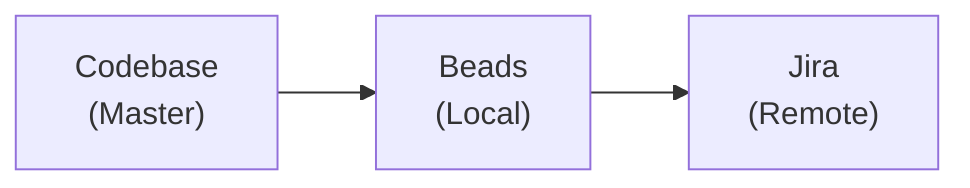

# /sync-jira - Jira <-> Beads Synchronization

> AI-driven sync between local Beads and Jira. Codebase is master data.

## Sync Philosophy



**Priority:** Code > Beads > Jira

## Sync Process

### Step 1: Analyze Current State

```bash
# Get all open beads
bd list --status=open
bd blocked

# Get open Jira issues for project
jira_search "project = VP AND status != Done ORDER BY updated DESC"
```

### Step 2: Match & Compare

For each bead, check:

1. Does it reference a Jira ticket (VP-XXX in title)?
2. If yes, compare status and description
3. If no, should it be created in Jira?

For each open Jira ticket:

1. Is there a matching bead?
2. If not, is it a planning-only task (no bead needed)?

### Step 3: Sync Actions

| Bead State | Jira State | Action                        |
| ---------- | ---------- | ----------------------------- |
| open       | missing    | Create Jira ticket            |
| open       | Done       | Close bead OR reopen Jira     |
| closed     | open       | Close Jira ticket             |
| blocked    | open       | Update Jira status to Blocked |
| missing    | open       | Ask: Create bead or ignore?   |

### Step 4: Update References

- Add Jira key to bead title: `VP-XXX: Task description`
- Add Beads ID to Jira description: `Beads ID: VP-xxxx`

## Command Execution

When user runs `/sync-jira`:

1. **Fetch both sources:**

   - `bd list --status=open` + `bd blocked`
   - `jira_search "project = VP AND status != Done"`

2. **Build comparison table:**

   - Match by VP-XXX reference or similar title
   - Identify mismatches

3. **Present diff to user:**

   ```
   SYNC ANALYSIS:

   ✅ In sync: 3 tasks
   ⚠️  Beads → Jira needed: 2 tasks
   ⚠️  Jira → Beads needed: 1 task
   ❌ Conflicts: 0

   Proceed with sync? [y/n]
   ```

4. **Execute sync with user approval**

5. **Cleanup old beads:**
   ```bash
   # Remove tombstones and old closed issues (optional)
   bd admin cleanup --older-than 30 --dry-run  # Preview
   bd admin cleanup --older-than 30 --force    # Execute
   ```

## Examples

### Sync blocked task to Jira

```
Bead VP-zhgs (blocked): "Delete GitLab scripts"
→ Create VP-503 in Jira with BLOCKED status
→ Update bead title: "VP-503: Delete GitLab scripts"
```

### Close Jira from completed bead

```
Bead VP-abc (closed): "VP-123: Fix bug"
Jira VP-123: status = "In Progress"
→ Transition Jira to Done
```

## What NOT to sync

- Epic-level planning (Jira only)
- One-off quick fixes (Beads only)
- Retrospective items (Jira only)
- Session-specific tasks (Beads only, temporary)

## Manual Triggers

- `/sync-jira` - Full bidirectional sync
- `/sync-jira --to-jira` - Push beads to Jira only
- `/sync-jira --from-jira` - Pull Jira to beads only
- `/sync-jira --dry-run` - Show what would change
