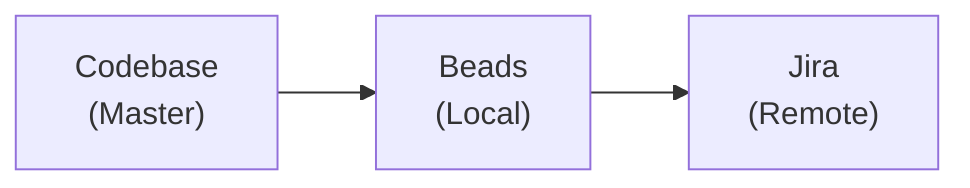

# /sync-jira - Jira <-> Beads Synchronization

> AI-driven sync between local Beads and Jira. Codebase is master data.

## Integration Mode Detection

**FIRST:** Check `.ai-project.yaml` for integration mode:

```yaml
services:
  task_tracking:
    type: 'jira'
    integration_mode: 'cli'  # or 'mcp'
    key_prefix: 'VP-'
```

| Mode | Tools | Server |
|------|-------|--------|
| `cli` | Bash (`jira issue ...`) | N/A |
| `mcp` | MCP tools (`jira_*`) | `mcp-atlassian` |

## Sync Philosophy



**Priority:** Code > Beads > Jira

## Sync Process

### Step 1: Analyze Current State

```bash
# Get all open beads
bd list --status=open
bd blocked
```

<details>
<summary><b>MCP Mode (integration_mode: 'mcp')</b></summary>

```typescript
// Get open Jira issues
CallMcpTool({
  server: 'mcp-atlassian',
  toolName: 'jira_search',
  arguments: {
    jql: 'project = <JIRA_PROJECT> AND status != Done ORDER BY updated DESC'
  }
})
```

</details>

<details>
<summary><b>CLI Mode (integration_mode: 'cli')</b></summary>

```bash
# Get open Jira issues
jira issue list --raw -q "project = <JIRA_PROJECT> AND status != Done ORDER BY updated DESC"
```

</details>

### Step 2: Match & Compare

For each bead, check:

1. Does it reference a Jira ticket ({PREFIX}-XXX in title)?
2. If yes, compare status and description
3. If no, should it be created in Jira?

For each open Jira ticket:

1. Is there a matching bead?
2. If not, is it a planning-only task (no bead needed)?

### Step 3: Sync Actions

| Bead State | Jira State | Action                        |
| ---------- | ---------- | ----------------------------- |
| open       | missing    | Create Jira ticket            |
| open       | Done       | Close bead OR reopen Jira     |
| closed     | open       | Close Jira ticket             |
| blocked    | open       | Update Jira status to Blocked |
| missing    | open       | Ask: Create bead or ignore?   |

#### Create Jira Ticket

<details>
<summary><b>MCP Mode</b></summary>

```typescript
CallMcpTool({
  server: 'mcp-atlassian',
  toolName: 'jira_create_issue',
  arguments: {
    project_key: '<JIRA_PROJECT>',
    summary: 'Task description from bead',
    issue_type: 'Task',
    labels: ['from-beads']
  }
})
```

</details>

<details>
<summary><b>CLI Mode</b></summary>

```bash
jira issue create --no-input \
  -t "Task" \
  -s "Task description from bead" \
  -l "from-beads"
```

</details>

#### Close Jira Ticket

<details>
<summary><b>MCP Mode</b></summary>

```typescript
CallMcpTool({
  server: 'mcp-atlassian',
  toolName: 'jira_transition_issue',
  arguments: {
    issue_key: '{PREFIX}-XXX',
    transition_name: 'Done'
  }
})
```

</details>

<details>
<summary><b>CLI Mode</b></summary>

```bash
jira issue move {PREFIX}-XXX "Done"
```

</details>

#### Update Jira Status

<details>
<summary><b>MCP Mode</b></summary>

```typescript
CallMcpTool({
  server: 'mcp-atlassian',
  toolName: 'jira_transition_issue',
  arguments: {
    issue_key: '{PREFIX}-XXX',
    transition_name: 'Blocked'
  }
})
```

</details>

<details>
<summary><b>CLI Mode</b></summary>

```bash
jira issue move {PREFIX}-XXX "Blocked"
```

</details>

### Step 4: Update References

- Add Jira key to bead title: `{PREFIX}-XXX: Task description`
- Add Beads ID to Jira description: `Beads ID: bd-xxxx`

## Command Execution

When user runs `/sync-jira`:

1. **Fetch both sources:**

   - `bd list --status=open` + `bd blocked`
   - Jira search (MCP or CLI based on integration_mode)

2. **Build comparison table:**

   - Match by {PREFIX}-XXX reference or similar title
   - Identify mismatches

3. **Present diff to user:**

   ```
   SYNC ANALYSIS:

   ✅ In sync: 3 tasks
   ⚠️  Beads → Jira needed: 2 tasks
   ⚠️  Jira → Beads needed: 1 task
   ❌ Conflicts: 0

   Proceed with sync? [y/n]
   ```

4. **Execute sync with user approval**

5. **Cleanup old beads:**

   ```bash
   # Remove tombstones and old closed issues (optional)
   bd admin cleanup --older-than 30 --dry-run  # Preview
   bd admin cleanup --older-than 30 --force    # Execute
   ```

## Examples

### Sync blocked task to Jira

**MCP Mode:**

```typescript
// Create issue
CallMcpTool({
  server: 'mcp-atlassian',
  toolName: 'jira_create_issue',
  arguments: {
    project_key: '<JIRA_PROJECT>',
    summary: 'Delete GitLab scripts',
    issue_type: 'Task'
  }
})
// Returns: {PREFIX}-503

// Transition to Blocked
CallMcpTool({
  server: 'mcp-atlassian',
  toolName: 'jira_transition_issue',
  arguments: {
    issue_key: '{PREFIX}-503',
    transition_name: 'Blocked'
  }
})
```

**CLI Mode:**

```bash
# Create issue
jira issue create --no-input -t "Task" -s "Delete GitLab scripts"
# Returns: {PREFIX}-503

# Transition to Blocked
jira issue move {PREFIX}-503 "Blocked"
```

Then update bead:

```bash
bd update bd-zhgs --title="{PREFIX}-503: Delete GitLab scripts"
```

### Close Jira from completed bead

**MCP Mode:**

```typescript
CallMcpTool({
  server: 'mcp-atlassian',
  toolName: 'jira_transition_issue',
  arguments: {
    issue_key: '{PREFIX}-123',
    transition_name: 'Done'
  }
})
```

**CLI Mode:**

```bash
jira issue move {PREFIX}-123 "Done"
```

## What NOT to sync

- Epic-level planning (Jira only)
- One-off quick fixes (Beads only)
- Retrospective items (Jira only)
- Session-specific tasks (Beads only, temporary)

## Manual Triggers

- `/sync-jira` - Full bidirectional sync
- `/sync-jira --to-jira` - Push beads to Jira only
- `/sync-jira --from-jira` - Pull Jira to beads only
- `/sync-jira --dry-run` - Show what would change

## References

- `@jira-cli.md` - CLI mode command reference
- `@mcp-atlassian.md` - MCP mode tool reference
- `@beads` - Core Beads workflow
- `@tool-selection` - MCP tools reference
