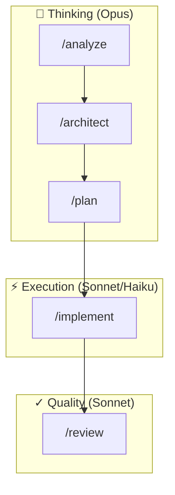
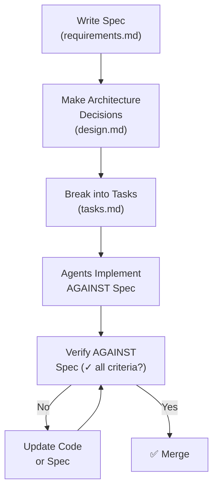
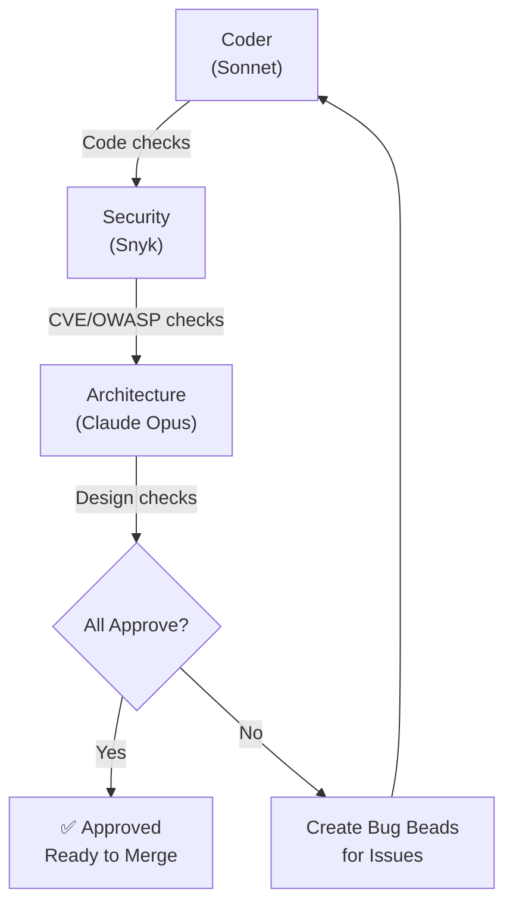
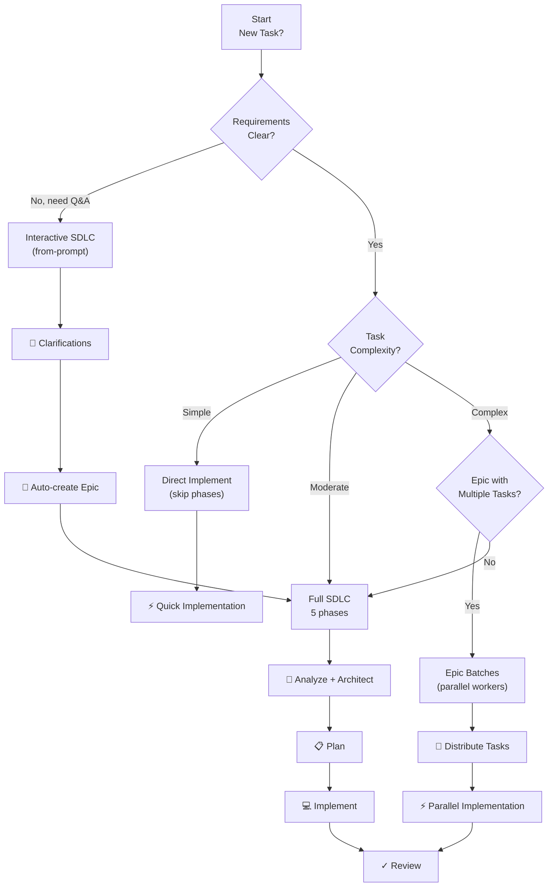
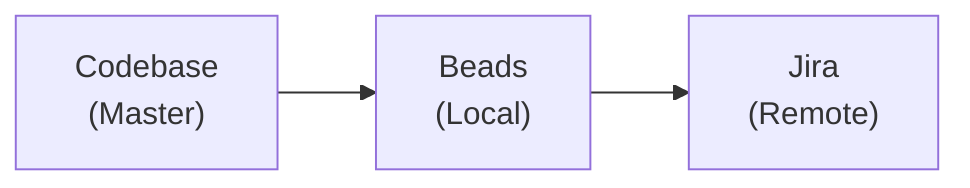

# SDLC Workflow

> **Philosophy:** Smart model thinks ONCE → cheap model executes MANY times.

## Model Selection by Phase

| Phase        | Complexity  | Recommended Model  | Alternative      |
| ------------ | ----------- | ------------------ | ---------------- |
| `/analyze`   | High        | **Opus**           | Sonnet           |
| `/architect` | High        | **Opus**           | -                |
| `/plan`      | Medium-High | **Opus** / Sonnet  | -                |
| `/implement` | Low-Medium  | **Sonnet** / Haiku | GLM-4.7 (Cursor) |
| `/review`    | Medium      | **Sonnet**         | Opus (critical)  |

**Switch model in-session:** `/model sonnet` or `/model haiku`

## Overview


```mermaid
flowchart TB
    subgraph Thinking["🧠 Thinking (Opus)"]
        A["/analyze"] --> B["/architect"]
        B --> C["/plan"]
    end

    subgraph Execution["⚡ Execution (Sonnet/Haiku)"]
        E["/implement"]
    end

    subgraph Quality["✓ Quality (Sonnet)"]
        D["/review"]
    end

    C --> E
    E --> D
```

**Workflow options:**

- **Claude Code only** - switch models per phase (`/model`)
- **Claude Code + Cursor** - Opus plans, GLM implements

## Phases

### 1. ANALYZE (`/analyze`)

**Tool:** Claude Code (Opus)
**Purpose:** Understand requirements, clarify scope, identify unknowns

**Input:**

- User request or Jira ticket
- Existing documentation

**Output:** `beads-XXX` with:

- Clear problem statement
- User stories / acceptance criteria
- Identified unknowns and questions
- Scope boundaries (what's in/out)

**Handoff:** Creates architecture-ready analysis

---

### 2. ARCHITECT (`/architect`)

**Tool:** Claude Code (Opus)
**Purpose:** Make technical decisions, design system structure

**Input:**

- Analysis bead from Step 1
- Or: Direct request for architecture

**Output:** `beads-XXX` with:

- Component architecture
- Data flow diagrams
- Technology choices
- API contracts
- Integration points

**Handoff:** Creates planning-ready architecture

---

### 3. PLAN (`/plan`)

**Tool:** Claude Code (Opus)
**Purpose:** Create detailed implementation roadmap

**Input:**

- Architecture bead from Step 2
- Or: Direct request with clear requirements

**Output:** `beads-XXX` with:

- Step-by-step implementation guide
- Files to create/modify
- Code patterns to follow
- Testing strategy
- Acceptance criteria

**Handoff:** Creates implementation-ready plan

---

### 4. IMPLEMENT (`/implement`)

**Tool:** Cursor (GLM-4.7)
**Purpose:** Write code following the plan

**Input:**

- Plan bead from Step 3

**Output:**

- Code changes
- Tests
- Documentation updates
- Closed bead

**Handoff:** Signals completion for review

---

### 5. REVIEW (`/review`)

**Tool:** Claude Code (Opus)
**Purpose:** Verify implementation quality

**Input:**

- Git diff / changed files
- Original requirements

**Output:**

- Approval or feedback
- Bug/improvement beads if needed

**Handoff:** Approve → Done, or Feedback → back to Implement

---

## Quick Commands

| Phase     | Command                | Tool   | Input        | Output             |
| --------- | ---------------------- | ------ | ------------ | ------------------ |
| Analyze   | `/analyze "request"`   | Claude | Request      | Analysis bead      |
| Architect | `/architect beads-XXX` | Claude | Analysis     | Architecture bead  |
| Plan      | `/plan beads-XXX`      | Claude | Architecture | Plan bead          |
| Implement | `/implement beads-XXX` | Cursor | Plan         | Code + closed bead |
| Review    | `/review`              | Claude | Git diff     | Approval/Feedback  |

## Workflow Examples

### Full Cycle (New Feature)

```
Claude Code:  /analyze "Add user authentication"
              → creates beads-001 (analysis)

Claude Code:  /architect beads-001
              → creates beads-002 (architecture)

Claude Code:  /plan beads-002
              → creates beads-003 (implementation plan)

Cursor:       /implement beads-003
              → writes code, closes beads-003

Claude Code:  /review
              → reviews changes, approves or creates feedback bead
```

### Quick Fix (Bug)

```
Claude Code:  /plan "Fix login redirect bug"
              → creates beads-004 (direct plan)

Cursor:       /implement beads-004
              → fixes bug, closes bead
```

### Skip to Planning (Clear Requirements)

```
Claude Code:  /plan "Add dark mode toggle - use existing theme context"
              → creates implementation plan directly

Cursor:       /implement beads-XXX
```

## Bead Types by Phase

| Phase     | Bead Type    | Priority | Example Title                          |
| --------- | ------------ | -------- | -------------------------------------- |
| Analyze   | `feature`    | P2       | "Analysis: User auth requirements"     |
| Architect | `feature`    | P2       | "Architecture: Auth system design"     |
| Plan      | `task`       | P1-P2    | "Implement: Login component"           |
| Review    | `bug`/`task` | P1       | "Fix: Missing error handling in login" |

## Phase Transitions

```
beads-001 (analysis)     →  status: closed, next: beads-002
beads-002 (architecture) →  status: closed, next: beads-003
beads-003 (plan)         →  status: in_progress (Cursor working)
beads-003 (plan)         →  status: closed (implementation done)
```

## Skipping Phases

Not every task needs all phases:

| Task Type   | Phases Needed                         |
| ----------- | ------------------------------------- |
| New feature | All 5 phases                          |
| Enhancement | Plan → Implement → Review             |
| Bug fix     | Plan → Implement                      |
| Refactor    | Architect → Plan → Implement → Review |
| Simple fix  | Implement only                        |

---

## SDD (Specification-Driven Development) Integration

> **New Rule:** See `@sdd-patterns` in `.cursor/rules/124-sdd-patterns.mdc` for complete SDD patterns.

> **Before implementing**: Write executable specs as binding contracts for all agents.

### Quick SDD Workflow


```mermaid
flowchart TB
    A["Write Spec<br/>(requirements.md)"] --> B["Make Architecture<br/>Decisions<br/>(design.md)"]
    B --> C["Break into Tasks<br/>(tasks.md)"]
    C --> D["Agents Implement<br/>AGAINST Spec"]
    D --> E["Verify AGAINST<br/>Spec (✓ all criteria?)"]
    E -->|No| F["Update Code<br/>or Spec"]
    F --> E
    E -->|Yes| G["✅ Merge"]
```

### Three-File SDD Pattern

Create these files for every feature (before implementation):

#### 1. `docs/specs/[feature].spec.md` - The Spec Contract (Immutable)

```markdown
# Feature Spec: [Name]

## Requirements (Executable)

- [ ] Requirement 1
- [ ] Requirement 2

## Acceptance Criteria

| Scenario   | Input  | Expected |
| ---------- | ------ | -------- |
| [scenario] | [data] | [result] |

## Out of Scope

- [What's NOT included]
```

**Purpose**: WHAT to build (immutable)

#### 2. `docs/specs/[feature].design.md` - Architecture Decisions

```markdown
# Design: [Feature]

## Decisions

- **Technology**: [Choice] because [rationale]
- **Trade-offs**: [Costs/benefits]
```

**Purpose**: WHY decisions were made

#### 3. `docs/specs/[feature].tasks.md` - Implementation Breakdown

```markdown
# Implementation Tasks

## Phase 1: Setup

- [ ] Create component structure
- [ ] Set up tests

## Phase 2: Core

- [ ] Implement hooks
- [ ] Add state
```

**Purpose**: Concrete subtasks with dependencies

### SDD Benefits

| Aspect               | Before   | With SDD              |
| -------------------- | -------- | --------------------- |
| Requirements clarity | Verbal   | Executable specs      |
| Review iterations    | 3-4      | 1-2 (spec-driven)     |
| Rework rate          | 40%      | <10%                  |
| Multi-agent sync     | Manual   | Automatic (same spec) |
| Test coverage        | Post-hoc | Built into spec       |

---

## Verification Swarms (Multi-Agent QA)

> **New Rule:** See `@verification-swarms` in `.cursor/rules/125-verification-swarms.mdc` for complete verification patterns.

> **Purpose**: Parallel verification BEFORE PR. Catches ~67% of issues early.

### Three-Agent Sequential Pattern


```mermaid
graph TB
    A["Coder<br/>(Sonnet)"] -->|Code checks| B["Security<br/>(Snyk)"]
    B -->|CVE/OWASP checks| C["Architecture<br/>(Claude Opus)"]
    C -->|Design checks| D{"All Approve?"}
    D -->|Yes| E["✅ Approved<br/>Ready to Merge"]
    D -->|No| F["Create Bug Beads<br/>for Issues"]
    F --> A
```

### Agent Responsibilities

**Coder Agent** (You):

- [ ] Build passes
- [ ] Tests pass (coverage > 80%)
- [ ] ESLint passing
- [ ] All spec criteria met

**Security Agent** (Snyk):

- [ ] No secrets exposed
- [ ] Input validation present
- [ ] XSS prevention
- [ ] No CVEs/dependencies issues
- [ ] OWASP Top 10 compliant

**Architecture Agent** (Opus):

- [ ] FSD architecture compliant
- [ ] Component design sound
- [ ] State patterns correct
- [ ] No circular dependencies
- [ ] Error handling comprehensive
- [ ] TypeScript coverage sufficient

### /review Integration

```
/review
  ↓ Runs verification swarm automatically
  ├─ Coder: Build + tests ✓
  ├─ Security: Snyk scan ✓
  └─ Architecture: Design review ✓
  ↓ All pass?
  └─ ✅ Ready to merge or ❌ Bug beads created
```

### Time & Quality Impact

| Metric            | Before     | With Swarm | Improvement |
| ----------------- | ---------- | ---------- | ----------- |
| PR review cycle   | 6-12 hours | 2-4 hours  | -67% time   |
| Rework iterations | 2-3        | <1         | -50% cycles |
| Bug escape rate   | 10%        | 2-3%       | -67% bugs   |
| Type coverage     | 85%        | 95%        | +10%        |

---

## Orchestration Modes (Perles)

> **New Docs:** See `docs/perles-workflow-matrix.md` for detailed decision flowchart and examples.

> Choose workflow based on task complexity and requirements clarity.

### Workflow Decision Matrix


```mermaid
flowchart TD
    A["Start<br/>New Task?"] --> B{"Requirements<br/>Clear?"}
    B -->|No, need Q&A| C["Interactive SDLC<br/>(from-prompt)"]
    B -->|Yes| D{"Task<br/>Complexity?"}
    D -->|Simple| E["Direct Implement<br/>(skip phases)"]
    D -->|Moderate| F["Full SDLC<br/>5 phases"]
    D -->|Complex| G{"Epic with<br/>Multiple Tasks?"}
    G -->|Yes| H["Epic Batches<br/>(parallel workers)"]
    G -->|No| F
    C --> I["👤 Clarifications"]
    I --> J["🤖 Auto-create Epic"]
    J --> F
    E --> K["⚡ Quick Implementation"]
    F --> L["🧠 Analyze + Architect"]
    L --> M["📋 Plan"]
    M --> N["💻 Implement"]
    N --> O["✓ Review"]
    H --> P["🔀 Distribute Tasks"]
    P --> Q["⚡ Parallel Implementation"]
    Q --> O
```

### When to Use Each

| Mode                 | Triggers                             | Use Case                                  | Time       |
| -------------------- | ------------------------------------ | ----------------------------------------- | ---------- |
| **Interactive SDLC** | Vague request, need clarifications   | "Add authentication flow" (unclear scope) | 4-6 hours  |
| **Full SDLC**        | Clear requirements, complex task     | "Migrate from Redux to Zustand"           | 6-12 hours |
| **Epic Batches**     | Parallel tasks, 5+ items             | Large feature with independent components | 8-16 hours |
| **Direct Implement** | Simple requirement, obvious solution | "Fix bug in login form"                   | <1 hour    |

### Workflow Selection Guide

**Ask these questions:**

1. **Are requirements clear?**
   - Yes → Continue below
   - No → Use Interactive SDLC (Q&A clarifies scope)

2. **How many tasks?**
   - Simple (1 file) → Direct Implement
   - Moderate (3-5 files) → Full SDLC
   - Large (5+ files) → Epic Batches (if independent)

3. **How much thinking?**
   - Clear path → Plan → Implement
   - Complex design → Analyze → Architect → Plan → Implement → Review
   - Multiple approaches → Epic Batches (parallel exploration)

### Perles Commands

```bash
# Start Perles
perles

# Select workflow (Ctrl+O → Ctrl+P)
# → Interactive SDLC from Prompt
# → Full SDLC Cycle
# → Epic Parallel Batches

# Or tag issue for direct workflow
bd update {PREFIX}-123 --labels="full-sdlc"
bd update {PREFIX}-456 --labels="epic-batches"
```

---

## Handoff Protocol

### Claude Code → Cursor

1. Create bead with full plan
2. Run `bd sync --flush-only`
3. User switches to Cursor
4. User says `/implement beads-XXX`

### Cursor → Claude Code

1. Complete implementation
2. Run `bd close beads-XXX`
3. Run `bd sync --flush-only`
4. User switches to Claude Code
5. User says `/review`

## Memory Persistence

Each phase saves to hindsight:

```
/analyze  → retain("Analysis beads-XXX: [key findings]")
/architect → retain("Architecture beads-XXX: [key decisions]")
/plan     → retain("Plan beads-XXX: [implementation approach]")
/review   → retain("Review beads-XXX: [approval/feedback]")
```

This ensures context survives across sessions and tools.

---

## Hook Integration

The Claude Code hooks system automates key workflow steps:

### Session Start Hook

**File:** `hooks/session-start.sh`

Automatically runs when starting a new session:

- Primes beads context (`bd prime`)
- Shows in-progress work
- Displays ready task count

### Pre-commit Hook

**File:** `hooks/pre-commit.sh`

Runs quality gates before commits:

- Executes `npm run quality:gates`
- Blocks commit if gates fail
- Provides immediate feedback

### Bash Validator Hook

**File:** `hooks/validate-bash.sh`

Validates bash commands before execution:

- Blocks dangerous patterns (rm -rf /, etc.)
- Warns about destructive commands (--force, --no-verify)
- Protects against accidental damage

### Hook Configuration

**File:** `settings.json`

```json
{
  "hooks": {
    "PreToolUse": [
      {
        "matcher": "Bash",
        "hooks": [{ "type": "command", "command": ".claude/hooks/validate-bash.sh" }]
      }
    ],
    "UserPromptSubmit": [
      {
        "hooks": [{ "type": "command", "command": ".claude/hooks/session-start.sh" }]
      }
    ]
  }
}
```

**Hook Events:**

- `PreToolUse` - Before tool execution (use `matcher` for tool name)
- `PostToolUse` - After tool execution
- `UserPromptSubmit` - When user sends a message (no matcher needed)
- `Stop` - When session ends (no matcher needed)

### Troubleshooting Hooks

If hooks fail:

1. Test manually: `hooks/<hook-name>.sh`
2. Check permissions: `chmod +x hooks/*.sh`
3. Review `TROUBLESHOOTING.md` for solutions

---

## Memory Cleanup (Sprint/Milestone Close)

> **Trigger:** At the end of each sprint or milestone close

### Purpose

Prevent memory bloat by removing outdated session data while preserving valuable patterns and lessons.

### Cleanup Strategy

| Bank          | Action    | Criteria                         |
| ------------- | --------- | -------------------------------- |
| `alice`       | Prune old | Keep only last 7 days            |
| `patterns`    | Keep      | Preserve all (valuable)          |
| `lessons`     | Keep      | Preserve all (valuable)          |
| `reflections` | Delete    | Recreate if needed               |
| `session`     | Delete    | Session-specific, not persistent |

### Cleanup Commands

```bash
# Quick cleanup script (run at sprint close)
CUTOFF_DATE=$(date -v-7d +%Y-%m-%d)  # 7 days ago

# 1. Delete temporary banks
curl -X DELETE "http://localhost:8888/v1/default/banks/reflections"
curl -X DELETE "http://localhost:8888/v1/default/banks/session"

# 2. Prune old alice documents
curl -s "http://localhost:8888/v1/default/banks/alice/documents?limit=500" | \
jq -r ".items[] | select(.created_at < \"$CUTOFF_DATE\") | .id" | \
while read doc_id; do
  [ -n "$doc_id" ] && curl -s -X DELETE "http://localhost:8888/v1/default/banks/alice/documents/$doc_id"
done

# 3. Verify
echo "Remaining banks:"
curl -s "http://localhost:8888/v1/default/banks" | jq '.banks[].bank_id'
```

### Cleanup Checklist

At sprint/milestone close:

1. [ ] Run cleanup script above
2. [ ] Verify `patterns` and `lessons` banks intact
3. [ ] Check `alice` has recent documents only
4. [ ] Run `bd sync --flush-only` to export beads

### What to Preserve

**Always Keep:**

- User preferences and workflow settings
- Architecture decisions
- Validated patterns
- Lessons learned from bugs/issues

**Always Delete:**

- Test/debug session data
- Temporary exploration notes
- Duplicate or superseded information
- Session-specific context (recreated each session)

---

## Jira Synchronization (`/sync-jira`)

> AI-driven sync between local Beads and Jira. Codebase is master data.

### Data Flow


```mermaid
flowchart LR
    A["Codebase<br/>(Master)"] --> B["Beads<br/>(Local)"] --> C["Jira<br/>(Remote)"]
```

**Priority:** Code > Beads > Jira

### When to Sync

| Trigger             | Action                           |
| ------------------- | -------------------------------- |
| Sprint close        | Full sync: `/sync-jira`          |
| Task completed      | Auto: bead close → Jira close    |
| New feature started | Create bead first, sync to Jira  |
| Blocked by external | Update bead status, sync to Jira |

### Sync Rules

| Bead State | Jira State | Action                             |
| ---------- | ---------- | ---------------------------------- |
| open       | missing    | Create Jira ticket                 |
| open       | Done       | Close bead OR reopen Jira          |
| closed     | open       | Close Jira ticket                  |
| blocked    | open       | Update Jira to Blocked             |
| missing    | open       | Ask: Create bead or planning-only? |

### Reference Format

- **Bead title:** `{PREFIX}-XXX: Task description`
- **Jira description:** Include `Beads ID: bd-xxxx`

### Commands

```bash
/sync-jira              # Full bidirectional sync
/sync-jira --to-jira    # Push beads → Jira only
/sync-jira --from-jira  # Pull Jira → beads only
/sync-jira --dry-run    # Preview changes
```

### What NOT to Sync

| Keep in Jira only    | Keep in Beads only     |
| -------------------- | ---------------------- |
| Epic-level planning  | Session-specific tasks |
| Retrospective items  | Quick one-off fixes    |
| Stakeholder requests | Local experiments      |

### Full Documentation

See `commands/sync-jira.md` for detailed sync process.

---

## Beads Environment Setup

### BD_ENABLED Variable

Beads интеграция контролируется переменной окружения `BD_ENABLED` в `.env.development.local`:

| BD_ENABLED       | Поведение                                                   |
| ---------------- | ----------------------------------------------------------- |
| `1` или `true`   | Полная интеграция: hooks синхронизируют beads автоматически |
| `0` или не задан | Beads невидим: файл `issues.jsonl` не меняется в коммитах   |

### Настройка для разработчика

```bash
# .env.development.local
BD_ENABLED=1  # Включить beads интеграцию
```

### Что происходит при BD_ENABLED=1

1. **Session start hook** (`session-start.sh`):
   - `bd prime` — загрузка контекста
   - `bd ready` — доступные задачи
   - `bd blocked` — заблокированные задачи

2. **Pre-commit hook** (`.husky/pre-commit`):
   - `bd sync --flush-only` — экспорт в JSONL
   - `git add .beads/issues.jsonl` — добавление в коммит

3. **AI-assisted** (автоматически):
   - Создание задач через `bd create`
   - Закрытие через `bd close`
   - Синхронизация через `bd sync --flush-only`

### Для коллег без BD_ENABLED

- Hooks пропускают beads операции
- Файл `issues.jsonl` не меняется в их коммитах
- Никаких блокировок на checkout/merge
- Beads полностью невидим

---

## Beads Troubleshooting

### Critical: Database vs JSONL Sync

**Architecture:**

```
.beads/
├── beads.db        # SQLite (runtime state, may have newer data)
└── issues.jsonl    # JSONL (export format, synced on flush)
```

**Key Lesson:** Database can be MORE CURRENT than JSONL. The `bd` commands update SQLite first, then JSONL on `bd sync --flush-only`.

### ⚠️ NEVER Do This

```bash
# WRONG: Directly modifying .beads/ files without sync
rm .beads/beads.db          # Data loss!
vim .beads/issues.jsonl     # Will be overwritten

# WRONG: Restoring JSONL from git without understanding state
git checkout .beads/issues.jsonl  # Loses recent changes
```

### ✅ Safe Operations

```bash
# ALWAYS flush before any manual operations
bd sync --flush-only

# Then safe to modify JSONL
python3 filter_issues.py

# Rebuild database from JSONL
rm .beads/beads.db
bd doctor --fix -y
```

### Recovery from Data Loss

If database was deleted accidentally:

1. **Check git for JSONL state:**

   ```bash
   git diff .beads/issues.jsonl
   git log -3 --oneline -- .beads/issues.jsonl
   ```

2. **Restore and re-apply changes:**

   ```bash
   git checkout .beads/issues.jsonl  # Restore last committed
   # Manually re-apply recent bd commands
   bd update bd-xxx --status=blocked
   bd close bd-yyy
   bd sync --flush-only
   ```

3. **Verify integrity:**

   ```bash
   bd doctor
   bd list --status=open
   bd blocked
   ```

### Tombstone Cleanup

Tombstones are soft-deleted records. To remove:

```bash
# bd admin cleanup removes ALL closed + tombstones older than N days
# For tombstone-only removal, use Python filter:
python3 << 'PYEOF'
import json
with open('.beads/issues.jsonl', 'r') as f:
    lines = f.readlines()
with open('.beads/issues.jsonl', 'w') as f:
    for line in lines:
        obj = json.loads(line.strip())
        if obj.get('status') != 'tombstone':
            f.write(json.dumps(obj, ensure_ascii=False) + '\n')
PYEOF

# Rebuild database
rm .beads/beads.db
bd doctor --fix -y
```

### Common Issues

| Issue                  | Cause                                | Fix                                            |
| ---------------------- | ------------------------------------ | ---------------------------------------------- |
| Stack overflow in bd   | Daemon corruption                    | `pkill -f "bd daemon"`, use `bd --no-daemon`   |
| Sync divergence        | DB/JSONL mismatch                    | `bd sync --flush-only`, then `bd doctor --fix` |
| Missing recent changes | DB deleted                           | Restore JSONL from git, re-apply bd commands   |
| Tombstones remain      | `bd admin cleanup` needs time filter | Use Python filter (see above)                  |
